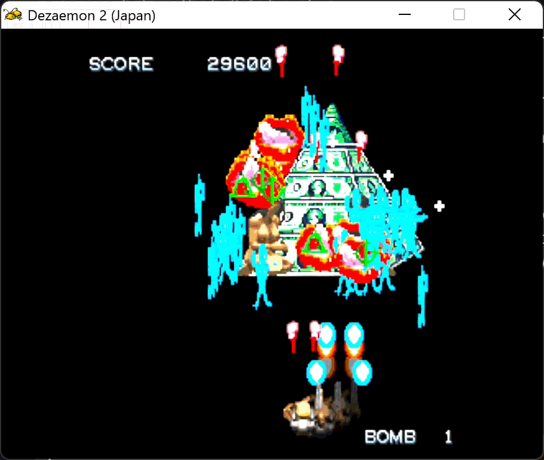
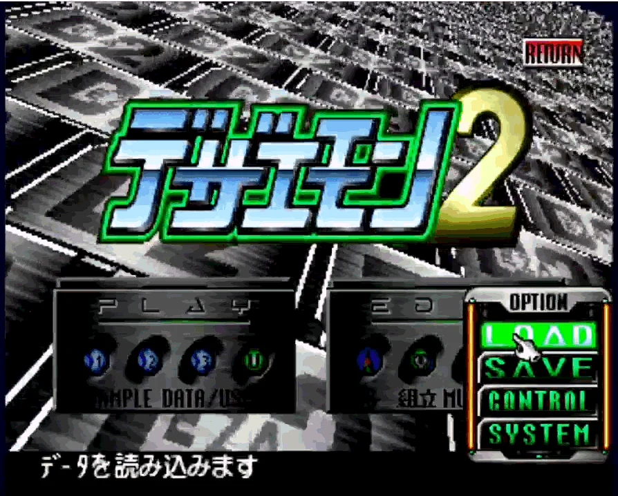
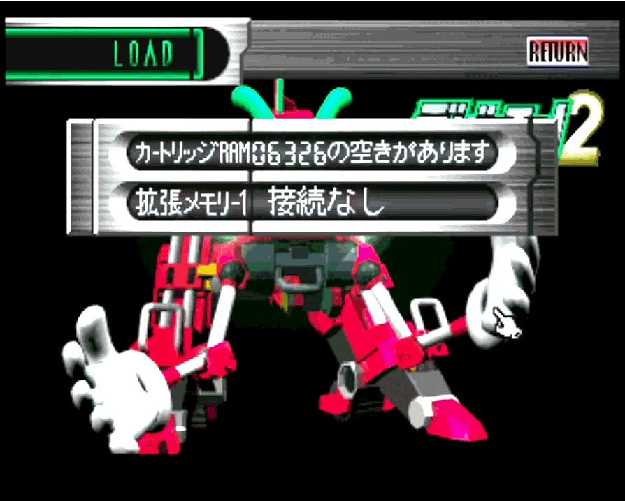
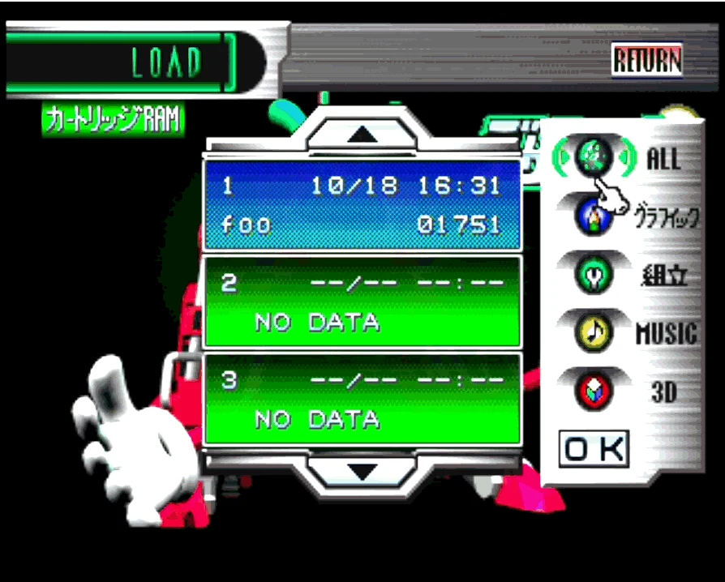
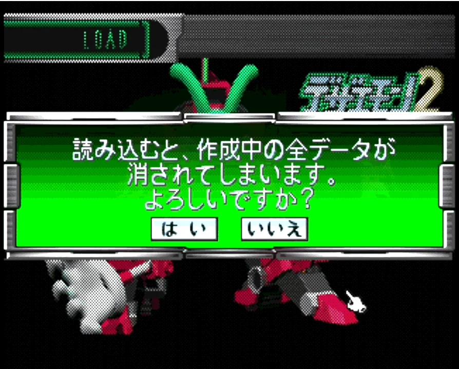
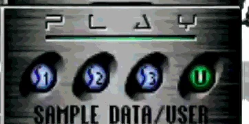

# shmupX — codemonkey.games



The final CMG launcher, rebuilt as **shmupX**: a Deno Fresh 2 + Vite app for
[Deno Deploy](https://deploy.deno.com) with a single built-in game — the shmupX
level editor, a standalone version of the cmg level editor.

The `.sav` / `game.json` pipeline (Dezaemon 2 Saturn save parsing, decoding,
mapping, atlas packing, schema validation) lives in the
[`packages/shmup-engine`](packages/shmup-engine) workspace member, published to
JSR as `@shmupx/shmup-engine`. The editor consumes it as a same-origin bundle
built by `deno task engine:bundle` into `static/engine/shmup-engine.js`.

## Layout

- `main.ts`, `routes/`, `vite.config.ts` — the Fresh shell (launcher marker
  injection + static files + fs routes).
- `desktop.ts`, `scripts/build-desktop.ts` — the packaged desktop launcher
  (`deno task build:windows` / `build:linux` / `build:mac`, see below).
- `lib/ps2/`, `scripts/build-ps2.ts` — the PlayStation 2 export
  (`deno task build:ps2`, see below). Pure Deno, no toolchain to install.
- `scripts/build-sav.ts` — the **Dezaemon 2 cart export**
  (`deno task
  build:sav`, see **Writing a .sav** below): a cloud level as the
  1,114,112-byte `.sav` MiSTer's Saturn core reads, its art cut to the Saturn or
  Super Famicom palette. The editor's DOWNLOAD .SAV / → SAVE SHELF rows run the
  same engine code in the page.
- `svelte-src/` — the launcher dashboard (Svelte 5), esbuild-bundled at build
  time into `static/dashboard.bundle.js` by `deno task dashboard:build`.
- `data/games.json` → `deno task games:manifest` → `static/games.manifest.json`
  — the OTA manifest the dashboard fetches (push to main = every client sees the
  new list, no rebuild).
- `data/eshop.json` — the **eShop** catalog, the global game list (see **The
  eShop** below). Baked into the same manifest as its `eshop` array; a game is
  added by pull request, and `deno task eshop:check` validates the entries.
- `static/editor/` — the shmupX level editor (single-file app). Its wave grid
  has a **VERT / HORIZ** switch on the stage rail: the same waves laid out top
  to bottom, or left to right the way a Dezaemon horizontal cart scrolls
  (auto-picked from a `.sav`'s game-mode bit). ADVANCED EDITORS → TILEMAP and
  PIXELS, and the map badge on the toolbar, open the two tools below on the open
  game.
- `static/palette.png` — the 288 Dezaemon 2 palette colours, one pixel each (see
  **The Dezaemon 2 palette** below); `palette-sheet.png` is the same as a
  picture. Both from `deno task deza:palette`.
- `static/pixel-editor/` — the **Pixel Editor**: 16×16-cell sprites drawn as
  palette indices over that palette and stored Saturn-native (see below).
- `static/tilemap-editor/` — the **SpriteX Tilemap Editor** mirrored here
  (spriteX's TILEMAP tab, plus level scenery in vertical/horizontal views, live
  pixel-sprite tiles and the **Tileset Extractor**). Both tools are in the CMG
  Desktop's Tools folder.
- `static/editor/dezaemon/` — the community Dezaemon 2 collection: 258
  `saves/Dez 2 - *.sav` games, `games-db.json` (title/developer/genre metadata,
  each game's page on satakore.com, and the YouTube id of the playthrough on
  that page) and `saves.manifest.json` — the served index the editor's .SAV LOAD
  GAME shelf reads, regenerated by `deno task deza:manifest` inside
  `deno task build`. Deploy can serve `static/` but can't list it at runtime, so
  the manifest is committed, exactly like `games.manifest.json`. A save the
  table knows gets a WEBSITE button on the import sheet and a VIEW WEBSITE row
  in the drawer; the 188 with a video get a ▶ on the shelf and on the launcher's
  coverflow, which previews it muted in place while hovered (or held, on a touch
  screen) and opens it in full on a press. Under the CMG Desktop (`/desktop/`)
  those links open in its Web Browser window rather than a browser tab — YouTube
  watch URLs are framed as the /embed/ player, since the watch page itself
  refuses embedding. 258 covers is more than left/right can walk, so the
  coverflow carries an A–Z rail down its right edge — swipe or drag it to scrub
  to a letter (`[` / `]` and the right stick step the same buckets) — and a
  filter over title, Japanese title, developer and genre, opened with `/`,
  ⌘/Ctrl+F or the ⌕ button. Buckets are derived from what is actually on the
  shelf, so a letter nobody used never appears, and pinned favorites keep their
  own ★ bucket at the top. Beside them, `mesh-library.json` is the ポリ吉 3D
  part library (224 meshes decoded from the disc's `MDLDT_01–56.CMP` by
  `deno task deza:meshlib`, committed — see **PlayStation 2** below) that the
  Model Viewer draws a save's sec7 compositions with.
- `static/editor/model-viewer.html` — the **Model Viewer**: a Dezaemon save's
  sec7 3D models (ポリ吉 part compositions, decoded by the engine but never used
  by play — the Saturn rendered them to CG cells) drawn on Phaser 4.2's
  `Mesh2D`. Phaser 4 has no 3D, so the engine package does the projection on the
  CPU (`packages/shmup-engine/src/model/`) and hands the game object flat
  screen-space triangles in painter order, coloured by pointing every UV at a
  cell of a swatch texture. Reached from the editor's toolbar badge, its
  drawer's MODEL VIEWER row and the .SAV import sheet's VIEW 3D link (the editor
  hands the decoded models over through `sessionStorage` and the viewer bridge
  database), from the CMG Desktop's Tools folder, with `?sav=<url>`, by dropping
  a `.sav` on it, or with `?demo=1`.
- `static/games/2028-ai/` — the editor's base game + play runtime (the Phaser 4
  engine that runs editor-authored levels). `game.bundle.js` here is a vendored
  prebuilt artifact — this repo has no build step for it (the sources live in
  the 2019-es7 checkout), so it carries a handful of edits by hand that a
  rebuild would silently drop:
  - `LEVEL_DATA_URL` fetches `foo.json` same-origin instead of from cmg's deploy
    origin. `tools/build-level/lib/stage.js` matches that exact string when it
    stages an offline export, so the two must change together.
  - Every font stack that read `Orbitron` — the Dezaemon title prompt
    (`dezaCellText`), the STAFF ROLL card's thanks and credit labels, and the
    standalone PAUSE panel — reads `athenaFont`: Dezaemon 2's own 8×8 game font,
    the one its kernel sets SCORE, PAUSE! and ESCAPE in. It is font 0 of the
    disc's `GFONT.BIN` (8bpp 8×8 cells from `0x800`, ASCII order; each body
    pixel carries its row index for the palette gradient and `0x0A` is a baked 1
    px drop shadow), lifted with `deno task deza:disc get` into spriteX's
    catalog as `atlases/athenaFont` (body pixels only, TEXT_SET1 order) and
    traced to TrueType by spriteX's `scripts/export-font.mjs` — one em per 8 px
    cell, so at the prompt's 8 px every glyph pixel is one canvas pixel and
    every glyph advances one grid cell. The runtime redraws the shadow with
    Phaser's text shadow (offset 1,1) rather than an outline stroke, which would
    fill a pixel face's counters in, and keeps fontStyle normal so no bold is
    synthesised. Shipped as `assets/fonts/athenaFont.ttf` beside its glyph
    sheet; `routes/games/2028-ai.tsx` and
    `tools/build-level/lib/shell-template.js` declare and preload it. The
    Orbitron files stay for the launcher and editor chrome, which still use it.
  - `tryNavigatorVibrate` returns early when
    `navigator.userActivation.hasBeenActive` is false. Chrome blocks
    `navigator.vibrate()` before the frame has been tapped and logs an
    intervention for every call; the blocked call _returns false_ rather than
    throwing, so the function's own `try/catch` never suppressed it. Upstream
    fix belongs in `2019-es7/src/haptics.js`.
  - `window.__cmgSetPaused = cmgSetPaused` exposes the cmg pause closure to
    `static/phaser-plugins/extract-mode.js`. Embedded in the launcher the
    standalone PAUSE panel is never built, so extract mode has no button to ride
    and must pause the game itself; routing through this one closure keeps a
    single `cmgPaused` flag and the per-`Sound` bookkeeping. The plugin falls
    back to its own `loop.sleep()` if the line goes missing.
  - `cmgBroadcastCheats` posts the Guide's Cheats submenu to the launcher once
    the level has resolved, because the set depends on which level is running —
    see **A Dezaemon save is not 2028.Ai** below. `routes/games/2028-ai.tsx`
    used to send a fixed list from its `<head>` and no longer does.
  - A boss dies as the boss whatever finished it. `updateDezaColumns` (the
    Dezaemon sub-weapon 5 / charge 2 columns) used to bill the boss sprite and
    hand the kill to `enemyDie`, which destroyed the sprite without telling the
    boss machinery: no death drift, no STAGE CLEAR, and a skull balloon and TIME
    label left hanging over an empty sky. It now keeps `scene.bossHp` and the
    danger balloon in step, skips the boss while it is flying in, and routes the
    kill through `bossDie` — and `enemyDie` itself hands a boss over to
    `bossDie`, so no other weapon can repeat it. Upstream fix belongs in
    `2019-es7/src/phaser/game-objects/Enemy.js`.
  - Akuma stays 2028.Ai's. `bossAdd` armed the hidden-boss sequence on stage 3
    of any run played without a continue — which every imported cart is, since
    it has no CONTINUE? — and `_startGokiSequence` then stopped time
    (`theWorldFlg`), found no `bossExtra` record in the cart's `bossData`
    (`mergeRecipe` replaces the base game's wholesale) and handed straight back
    to `bossShootStart` with the flag still set: the boss never fired, TIME sat
    at 99 and the ship could neither shoot nor bomb. The sequence is now armed
    only when the level is not a Dezaemon import and actually carries a
    `bossExtra`, and the no-record fallback lifts the time-stop before it hands
    over. Upstream fix belongs in `2019-es7/src/phaser/game-objects/Boss.js`.
  - The true ending is 2028.Ai's too. `decideEnding` sent any run whose last
    stage is index 4 to the credits from stage 3's clear unless four akebono
    finishes and no continue had unlocked it. NO STORY, which every import
    arrives with, skips that rule — but an author who turns the story scenes on
    for a five-stage cart lost its fifth stage, and a cart's bomb never counts
    as an akebono finish, so nothing could earn it back. The rule now applies
    only when the level is not a Dezaemon import. Upstream fix belongs in
    `2019-es7/src/phaser/AdvScene.js`.
  - Split Controller mode opens the two-player gate. `twoPlayerAllowed` admits a
    second ship only on `?players=2` or a save's own 2P bit, so the stock game
    could never seat the second half of a Legion Go's controller. The bundle's
    `cmg-*` message listener now takes `{ type: "cmg-splitpads-set", value }`
    from the launcher (see **Lenovo Legion Go** under **Controllers**) into
    `gameState.cmgSplitPads`, which `twoPlayerAllowed` honours like the URL
    override. Upstream home would be
    `2019-es7/src/phaser/game-objects/Player.js`.
  - The Dezaemon divergences below, all of them keyed off `isImportedLevel()`.
- `packages/shmup-engine/` — the JSR module: everything for editing/exporting
  `.sav` and `game.json` games.
- `spacetimedb/` — the online-2P module (see **Two players** below), published
  to SpacetimeDB. `static/netplay/` holds its generated client bindings and the
  bundled browser client.

## Tasks

```sh
deno task dev             # vite dev server (+ a Tailscale Funnel URL when available)
deno task build           # manifest + dashboard + engine bundle + vite build
deno task start           # serve the production build (_fresh/server.js)
deno task test            # shmup-engine tests
deno task check           # fmt + lint + type-check

deno task build:windows   # the launcher as a Windows .exe
deno task build:linux     # the launcher as a Linux .AppImage
deno task build:mac       # the launcher as a macOS .app
deno task build:desktop   # …whichever of those three matches this host
deno task shelf:list      # every game name the five build targets accept
deno task build:android   # one game from the shelf as an .apk (needs a name)
deno task build:ios       # …as an unsigned .ipa (needs a name, and a Mac)
deno task build:ps2       # a level as a PlayStation 2 USB folder
deno task build:ps2:zip   # …as one .zip of that folder
deno task build:ps2:iso   # …plus a bootable disc image
deno task build:sav       # a level as a Dezaemon 2 cart save (.sav) for MiSTer / hardware
deno task sav:run         # …then launch it in Mednafen, cart preloaded (Windows / Linux / WSL→Windows)
deno task sav:inject      # …or merge it into one of the five save slots on the cart this machine's emulator keeps
deno task eshop:check     # validate data/eshop.json against the built manifest
deno task eshop:covers    # cover a published eShop game that went out without one (dry run; --write uploads)

deno task player2:art     # re-bake player 2's ship from shmup-party-phaser4
deno task deza:tonebank   # cut the Saturn tone bank out of a SNDPAC.BIN
deno task deza:meshlib    # decode the ポリ吉 3D part library off a disc image
deno task deza:palette    # write static/palette.png (+ palette-sheet.png) from DEZA2.PAL
deno task sfc:probe       # look inside a Super Famicom Dezaemon SRAM dump (report / png / hex / diff)
deno task powerups:atlas  # cut dev-fixtures/powerups/*.gif into the runtime's animated pickup atlas
deno task tonebank:table  # re-pack the instrument map into src/audio/
deno task netplay:bundle  # bundle the online-2P browser client
deno task netplay:generate  # regenerate its bindings from the module
deno task netplay:publish   # publish the module (needs `spacetime login`)
```

### Sharing the dev server

`deno task dev` publishes the Vite server through
[Tailscale](https://tailscale.com) once it is up, so a phone or a handheld can
open it over HTTPS (the Gamepad API wants a secure context) — the tunnel that
ngrok used to provide, with nobody else in the path. `scripts/dev.ts` runs
`tailscale funnel <port>` in the foreground, which publishes
`https://<machine>.<tailnet>.ts.net` to the internet for exactly as long as the
dev server runs, and prints it in the banner; `lib/tailscale.ts` is the pure
half (`tests/tailscale_test.ts`). It is best-effort: with Tailscale missing,
logged out, or Funnel not enabled, the console says what to do and localhost
still works.

- Install Tailscale on the dev machine and log in (`tailscale up`). The macOS
  app and the Windows installer keep the CLI off PATH; both places are tried.
- **Funnel** (the default, public) needs HTTPS certificates enabled for the
  tailnet (admin console → DNS) and the `funnel` node attribute in the tailnet
  policy; when it is missing, the CLI's own enable link is printed and the dev
  server falls back to **Serve**.
- **Serve** (`SHMUPX_TUNNEL=serve`) gives the same URL to devices on your
  tailnet only. The other device joins the tailnet with an invite from the admin
  console (Users → Invite); put that link in `TAILSCALE_INVITE_URL` and the
  banner prints it beside the URL. It is a credential — environment only, never
  the repo.
- `SHMUPX_TUNNEL=off` skips the tunnel.

Through either tunnel `/api/host` answers "not available" — the request is
forwarded, and the machine it would describe is the server's, not the phone's.

## The Dezaemon 2 palette

<https://codemonkey.games/palette.png> is the whole colour set the Saturn editor
paints with — `DEZA2.PAL` off the disc, 18 rows × 16 entries of u16be RGB555 —
as a **1 × 288 PNG, one pixel per entry in file order**. It is a data file that
happens to be an image: any tool can `fetch` it, draw it to a canvas and read
the colours back, and because 5→8-bit replication is lossless, `channel >> 3`
recovers the exact 5-bit values (the round trip is tested in
[`tests/palette_png_test.ts`](tests/palette_png_test.ts)). The same 288 words
ship in the engine as `DEZA2_PALETTE_WORDS`
([`packages/shmup-engine/src/palette/deza2-palette.js`](packages/shmup-engine/src/palette/deza2-palette.js),
also on the flat surface and the `./palette` subpath), which is what
`deno task deza:palette` writes the PNG from; with a disc image in
`dev-fixtures/` it reads `DEZA2.PAL` too and refuses to build if the two
disagree.


The rows line up with a save's palette bank (sec4, 16 × 16) and then run two
past it:

| rows  | entries | what                                                                                                                     |
| ----- | ------- | ------------------------------------------------------------------------------------------------------------------------ |
| 0–11  | 0–191   | the **192 system colours** — byte-identical to rows 0–11 of every save's sec4 (verified across the corpus; not editable) |
| 12–15 | 192–255 | the **4 user palettes** — empty on the disc (`0x0000`, an `0x0021` end marker); a save carries whatever its author mixed |
| 16–17 | 256–287 | 32 entries the **editor UI** itself draws with — not part of a save, and not addressable by a CG pixel                   |

RGB555 is Saturn order — R in bits 0–4, G in 5–9, B in 10–14, bit 15 is the CRAM
flag — and a CG pixel byte is `(palette << 4) | colour`, i.e.
`row * 16 +
column`: **for the first 256 entries the palette index is the pixel
byte**, and index 0 (system row 0, colour 0) is the transparent background. That
is the contract everything below is written to, and the one the `.sav` writer
consumes: indexed cells whose bytes are already what sec0–3 store.

## Writing a .sav

The import pipeline runs backwards too. `packages/shmup-engine/src/write/` turns
a level record — the shape the editor saves to `levels/<name>` and
`static/games/2028-ai/foo.json` ships — plus its atlas frames into the eight raw
sections of a Dezaemon 2 save, and `src/bup-write.js` compresses them
(`src/compress.js`, the Okumura LZSS the decoder pins, within ~2% of the
Saturn's own stream sizes), builds the checksummed section table and writes the
payload into a freshly formatted 32 KB + 512 KB BackUpRam image,
0xFF-interleaved: the **1,114,112-byte `.sav`** every file in the community
collection is, dumped from carts for MiSTer's Saturn core. The file re-imports
through the same `normalize → parse → decodeSave → mapSaveToGame` path as a
community cart ([`tests/sav_export_test.ts`](tests/sav_export_test.ts) does it
end to end on `foo`), and on 2026-09-05 the exported `foo` cart was loaded and
played in Mednafen 1.29 with the real Saturn BIOS: the backup library accepted
the cart untouched, LOAD listed the slot, and the stage ran with its enemies,
drops and bombs. Real hardware and MiSTer remain untested.

```sh
deno task build:sav                          # foo.json -> build/sav/Dez 2 - foo.sav
deno task build:sav "Master Arena Mod"       # that cloud level
deno task build:sav ./backups/mygame.json    # a level record on disk
deno task build:sav foo --palette snes --snes-pal build/sav/foo.pal --report
```

**Run it in an emulator.** `deno task sav:run [level]` builds the `.sav`, merges
it into one Dezaemon 2 slot of Mednafen's `<disc>.bcr` cartridge save (backing
that cart up first, and leaving the other four slots and the `.bkr`
byte-identical) and launches Mednafen on the disc — the in-repo, cross-platform
stand-in for the ad-hoc launcher scripts, driven by
[`scripts/run-mednafen.ts`](scripts/run-mednafen.ts). It runs the host's own
Mednafen (native Windows launches `mednafen.exe`, Linux/macOS `mednafen`); from
WSL, point `MEDNAFEN_BIN` at a `mednafen.exe` and it launches the Windows build
over interop — the only one that sees a USB/Bluetooth pad. The emulator, the
disc image and the BIOS are the user's own (the disc and BIOS are community
content, never in the repo), so their paths come from flags or env vars
(`MEDNAFEN_BIN`, `DEZAEMON_DISC`, `MEDNAFEN_SAV`); the task prints what it
resolved and fails with a clear message when one is missing.

```sh
deno task sav:run                       # build foo, merge into the cart, launch Mednafen
deno task sav:run "Master Arena Mod"    # that cloud level
deno task sav:run --install-only        # merge into the cart, do not launch
DEZAEMON_DISC=/path/to/Dez2.cue deno task sav:run   # point it at your disc
```

**Into the cart you already have.** `deno task sav:inject [level]` puts a level
in one of Dezaemon 2's five save slots on whichever cartridge this machine's
emulator keeps — [`scripts/sav-inject.ts`](scripts/sav-inject.ts) picks the leg
by the operating system. Wherever it runs it does the same thing: the level goes
into one `DEZA2____NN` slot and **every other save on the cart stays
byte-identical**. Only the `.bcr` is written, never the `.bkr` (the console's
own memory, which holds Dezaemon 2's `DEZA2___SYS` options record) or the
`.smpc` (the emulated clock). Mednafen formats internal RAM itself when there is
no `.bkr`, so there is nothing to seed there either. `sav:run` and the editor's
`→ MEDNAFEN CART` row merge through the very same code and keep the same
guarantees; what they do not share is the refusal below, which is each leg's
own. The previous cart is copied to `backup/` (restore one with
`cp backup/<name>.<timestamp>.bcr <name>.bcr`) and the new one is read back —
every save that was already there compared byte for byte, and a cart carrying a
save the parser cannot follow refused rather than merged over — before the task
reports success. Quit the emulator first: they all rewrite their battery saves
on close, so an injection made while one is open would be thrown away; the task
refuses rather than do that, and `--force` overrides.

|                 | the cart                                                                                                                              | the leg                                                    |
| --------------- | ------------------------------------------------------------------------------------------------------------------------------------- | ---------------------------------------------------------- |
| **macOS**       | OpenEmu's Mednafen core, `~/Library/Application Support/OpenEmu/Mednafen/Battery Saves`                                               | [`inject-openemu.sh`](scripts/inject-openemu.sh)           |
| **Linux / WSL** | Mednafen: `$MEDNAFEN_HOME/sav`, else `~/.mednafen/sav` — or `$MEDNAFEN_SAV` to override                                               | [`inject-mednafen.sh`](scripts/inject-mednafen.sh)         |
| **Windows**     | Mednafen: `%MEDNAFEN_HOME%\sav`, `%HOME%\.mednafen\sav`, `<base>\mednafen\sav` beside your `Dezaemon 2.bat` — first with a cart in it | [`inject-mednafen-win.ts`](scripts/inject-mednafen-win.ts) |

The merge itself is one file, [`lib/cart-inject.ts`](lib/cart-inject.ts) —
shared by all three legs (through
[`scripts/inject-cart.ts`](scripts/inject-cart.ts), their command line) and by
`sav:run` and the editor's route; a leg only finds the cart, says when the
emulator is running, and starts the game afterwards.

The save file is found by **globbing**, never by a name built here. Mednafen
names saves from its `filesys.fname_sav`, whose stock `%f.%M%x` opens
`<disc>.bcr` when that file exists and `<disc>.<md5>.bcr` when it does not — and
that md5 is the core's own game hash, computed inside the emulator and derivable
from nothing else. Either name works, and when both are there the un-hashed one
is the live cart and the one written. The game must have written its cart once,
so start Dezaemon 2 and quit it before the first injection.

The **folder** is found the way Mednafen finds it: its base directory is
`$MEDNAFEN_HOME`, else `$HOME/.mednafen`, and — only when neither is set, which
is usual on Windows but not in Git Bash, MSYS2 or WSL interop — the folder
`mednafen.exe` is in. All of those are looked in and the first with a cart wins,
so a shell that happens to export `HOME` cannot send the level to a cart the
LOAD screen never shows.

```sh
deno task sav:inject foo                 # build foo, put it in the first free slot
deno task sav:inject foo --slot 1        # ...in slot 1, the top row of the LOAD screen
deno task sav:inject foo --dry-run       # say what would happen, write nothing
deno task sav:inject foo --no-launch     # inject only, do not start the game
deno task sav:inject --sav build/sav/'Dez 2 - foo.sav'   # a .sav you already have
deno task sav:inject foo --palette snes  # extra flags go straight to build:sav
```

(Those are `sh` quotes. In `cmd.exe` write `--sav "build/sav/Dez 2 - foo.sav"` —
single quotes are literal characters there.)

**On macOS** nothing is launched — OpenEmu is a library, so the run ends by
naming the slot to LOAD. A **save state** carries its own copy of the cartridge,
so resuming one hides the injection and writes the old cart back on quit; the
task says so when the disc has an Auto Save State, and leaves it alone (OpenEmu
tracks save states in its library database).

**On Linux and WSL** the game is started once the injection has been verified,
with your own `dezaemon2.sh` — `$DEZAEMON_SH`, else the one in `~/saturn`, `~`,
`~/bin` or beside the checkout. From WSL you may instead be driving the
_Windows_ Mednafen over interop, the only one that sees a USB pad; that one
keeps its saves beside `mednafen.exe`, so point `MEDNAFEN_SAV` at them — and
close it yourself, because no Linux process list can see it.

**On Windows** the cart is normally the one beside your `Dezaemon 2.bat`; set
`DEZAEMON_BAT` (`set DEZAEMON_BAT=C:\Users\you\Desktop\Dezaemon 2.bat` in `cmd`,
`$env:DEZAEMON_BAT=...` in PowerShell) when it is somewhere unobvious. That
`.bat` runs `install-cart.ps1` first, which **replaces** the whole cart with any
`.sav` waiting in `incoming\` or `Downloads\Dez 2 - *.sav`, flattening every
slot. `sav:inject` merges instead, and starts the `.bat`'s own second line —
`mednafen\mednafen.exe` on the `.cue`, same folder, same `mednafen.cfg`, same
pad mapping — rather than the `.bat` itself, so `install-cart.ps1` cannot undo
the injection. The `.bat` is the fallback when no `mednafen.exe` or disc is
found beside it. Anything waiting for `install-cart.ps1` is named in a warning
either way, `--dry-run` included.

Launching holds the terminal until Mednafen quits (as on Linux); the `.bat`
fallback ends in `start` and returns straight away. Whichever it is, the game is
**not** started when the cart written is not the one that emulator would read —
`--cart` somewhere else, `%MEDNAFEN_SAV%` outside a base directory — because a
LOAD screen without the level is worse than none. The run says which happened.

### Loading it in Dezaemon 2

`sav:inject` writes the cartridge; the game still has to read it. Dezaemon 2
keeps five save slots, and the task fills the slot whose name already matches
the level, else the lowest free one — slot 1 on a fresh cart — so the level
arrives at the top of the LOAD list under its own name. That name is the 10-byte
save comment, taken from the level's `name`, which is why a level called `foo`
reads `foo` on this screen.

**1. OPTION → LOAD** on the title screen. The prompt reads
「データを読み込みます」— _this loads data_.



**2. Pick the cartridge.** `カートリッジRAM` is the 512 KB backup cart — the one
`sav:inject` wrote, and the only one big enough for a level.
`拡張メモリー 接続なし` just means no expansion memory is attached, which is
normal.



**3. Choose the slot.** The level sits in slot 1 under its own name — `foo` here
— beside the date it was written and its size in blocks. The remaining slots
read `NO DATA` on a fresh cart, and the list scrolls, since there are five. The
column on the right (ALL / グラフィック / 組立 / MUSIC / 3D) picks which _parts_
of the save to read; leave it on ALL.



**4. Confirm.**
「読み込むと、作成中の全データが消されてしまいます。よろしいですか?」 — loading
throws away whatever is currently in the editor. `はい` to go ahead, `いいえ` to
back out.



**5. Play it.** Back at the title, the PLAY panel's `U` is the _user_ slot — the
level you just loaded. `S1`–`S3` are the disc's own sample games, and are not
what you want here.



If the LOAD list says `NO DATA` where the level should be, the cartridge the
game read is not the one the task wrote — check the `cart :` line the run
printed against the emulator notes above, and check that nothing rewrote the
cart afterwards (a running emulator, or a save state carrying its own copy of
the cartridge, both do).

**Palette.** A level's atlas is 24-bit; the cart holds 15-bit colours from a 16
× 16 bank, so the art is reduced on the way out, under one of two targets
(`src/palette/palette-target.js`):

| target   | model                                                                                                                                                                                                                                                                                                                                       |
| -------- | ------------------------------------------------------------------------------------------------------------------------------------------------------------------------------------------------------------------------------------------------------------------------------------------------------------------------------------------- |
| `saturn` | Dezaemon 2's own: the 192 **system colours** stay, the 64 **user slots** are filled adaptively (median cut) with the atlas colours the system ramps serve worst, and each 8bpp pixel snaps to its nearest of the 255 opaque entries — a sprite draws from every row at once                                                                 |
| `snes`   | the Super Famicom's: CGRAM is programmable 15-bit BGR in 16-colour rows and sprites are 4bpp, so **one sprite draws from one row** whose entry 0 is transparent. Up to four 15-colour rows (the save's user palettes) are built from the sprites assigned to them; `--snes-pal` also writes the bank as a 512-byte little-endian CGRAM file |

Both write a Saturn save — Saturn RGB555 and SNES BGR555 are the same bit layout
— the target only decides how the art is cut. In the editor the **SAV PALETTE**
switch under DEZAEMON 2 (SATURN) picks it.

**What lands where.** Every frame the game needs — the enemies' animation frames
(in the smallest of the seven zako art bands that holds them, downscaled only
past 64×64), the boss core (class F0–F3 by size), the ship (the level's own,
else Duke), the eight item icons (**Item icons** below) and two blast anims
(drawn procedurally), up to three bullet types from the enemies' projectiles,
the logo and subtitle as the drawn TITLE 1/2, an import's scenery — is packed
into the 1024 shared CG cells (mirrors and duplicates cost nothing). Each stage
gets its placement grid (json rows spawn last-first, so they are reversed into
scroll order; an import's `waveRows` puts waves back on their rows, an authored
level spaces them 12 rows apart across the 14-column playfield), its 60 enemy
records (an import's 18 bytes verbatim in their own slot; an authored enemy
encoded from hp/score/interval/speed as a straight-down flier that fires aimed
shots; a cell's drop digit becomes the record's death word), the boss trailer
(re-encoded from an import's decoded record, else four default patterns), scroll
curve and extents, and the settings block (mode from the grid's VERT/HORIZ
switch, loadouts, item slots, bullet configs, BGM table). An import's
`dezaemonBgm` songs go back into sec6; sec7 stays empty. Everything the format
does not carry — enemy names, story scenes, custom audio, the base game's stock
enemies' behaviours — is left behind, and the builder says so in its warnings.
Not yet written: the six credit strips and the 3D models.

**Item icons.** A save gives each of its eight item slots exactly one 16×16 cell
of the global sprite bank (refs 94–101), so a pickup in a cart is a **still** —
there is nowhere for a second frame to go. With the four winged letter emblems
sitting in `dev-fixtures/powerups/` as `powerup-s.gif`, `powerup-b.gif`,
`powerup-f.gif` and `powerup-r.gif`, `deno task build:sav` draws those rather
than the procedural coloured squares it otherwise falls back to. The letters map
**S = speed**, **B = barrier**, **F = power** and **R = all four weapon-change
slots**; bomb and score have no letter and keep their squares.
[`lib/powerup-emblems.ts`](lib/powerup-emblems.ts) takes the largest frame of
each GIF that fits the cell at native resolution — the art is stored blown up,
and the factor is measured rather than assumed — and centres it there, so
nothing is ever resampled; a letter this small does not survive it.
([`lib/ps2/gif.ts`](lib/ps2/gif.ts) decodes every frame of a GIF, disposal
methods and loop count included, rather than only the first.) The GIFs
themselves are **not in the repo** — `dev-fixtures/` is gitignored — so the
build reports how many of the nine item types wear an emblem, or that it is
drawing squares; a GIF that will not decode costs only its own letter, and a
checkout without the art exports exactly what it always did. Import the cart
back and its icons dress its drops again (`dezaemonItems.iconByDrop`), which is
what the runtime then draws for its pickups — the same path a community save's
own icons take.

**Animated pickups in the runtime.** What a cart cannot hold, the game can.
`deno task powerups:atlas` cuts the same four GIFs into
`static/games/2028-ai/assets/powerups.json` + `img/powerups.png` — 16 frames,
one row per letter, at the art's **native** resolution (it is drawn at 2×, and
the factor is measured, not assumed), which is 26×15, exactly the size of every
other pickup in the game. That atlas **is** committed: it is the derived
artefact, the way the tone bank and the mesh library are. It is deliberately a
texture of its own rather than part of `game_asset`, because an import swaps
`game_asset` for the level's atlas and would otherwise take the pickups away
just as a cart starts. `dropItem` runs the four-frame flap at the GIF's own 5fps
on the drops the letters name — **F** on the power-up, **R** on the weapon
change, **S** on the speed-up, **B** on the barrier — while bomb and score keep
their stock art.

A cart that drew its own item icons keeps them, because that art is its author's
— **unless the icon is one of these emblems**, which is exactly what a
`build:sav` export writes into the cell. That is how a shelf cart animates at
all: it carries a still per slot and would otherwise never flap. The writer
repaints every colour into the save's own palette on the way in, so colours
cannot identify it; the **silhouette** can, and survives exactly. The atlas
therefore also carries a 16×16 `emblemStill<L>.gif` per letter — the very still
the writer would have used — and the runtime compares alpha masks against it
once per drop and remembers the answer.

The flap is an ordinary `anims.play()` at `frameRate: 5`, the same path the
stock explosions take.

**In the editor.** Under DEZAEMON 2 (SATURN): **DOWNLOAD .SAV** builds the open
game in the page (the engine bundle) and downloads `Dez 2 - <name>.sav`; **→
SAVE SHELF** files the same bytes in this browser's IndexedDB, and the LOAD GAME
shelf lists them first under **YOUR .SAV EXPORTS** with a ✕ to forget one —
loading a row runs the normal import, so a save can be exported, reloaded and
re-edited without leaving the page. Both work on an imported cart as well as an
authored level, which is how a community game can be edited and written back
out. The store is [`static/deza-shelf.js`](static/deza-shelf.js), shared with
the launcher: its SAVED GAMES coverflow shelves the same builds ahead of the
collection under the ⬇ stop on the rail, finds them by search, re-reads the
shelf whenever the editor (an iframe of the launcher) files one, and PLAY on
such a cover hands the editor `?playExport=<id>` so the cart comes straight out
of the store — see **The eShop** below, which installs published Dezaemon games
onto the same shelf.

**Every shelf row wears its own title screen.** A record filed here gets a
`cover` rendered from its own cart bytes by `composeCover`
([`packages/shmup-engine/src/cover/compose-cover.js`](packages/shmup-engine/src/cover/compose-cover.js))
— the very function `deno task deza:upload` renders the 258 community covers
with, so a game you made is shot by the same rule as one dumped off a Saturn
cart and a coverflow of both is one shelf. It is pure data → RGBA: the drawn
KUMITATE TITLE page (bank refs 144..231, untrimmed, as the author laid it out)
over the busiest screenful of the game's own scenery, dimmed, with a light plate
behind a logo that would otherwise vanish into a dark backdrop; a cart with no
drawn title falls back to its biggest boss, then a strip of up to twelve
enemies, then CG page 0 — so every save gets a picture of _itself_. The 256×480
canvas is the runtime's own portrait viewport. Deno encodes the result with
`jsr:@img/png`, the browser with a canvas `toDataURL`; the pixels agree, the
bytes do not, so never compare their hashes.

The shelf fills it in inside `putDezaShelfEntry`, so every road on gets one: →
SAVE SHELF, an eShop install whose listing was published without art, and
`backfillDezaShelfCovers()` for anything filed before covers existed (both
readers call it when they open; it is free once the shelf is covered). Before
this, the editor's own exports drew a text card reading "DEZAEMON 2 / <title> /
YOUR EXPORT" where every community game had a picture, and PUBLISH TO ESHOP sent
whatever the TITLE EDITOR happened to be holding — nothing, for an import.

**A cart keeps its own title on the way back out.** The `.sav` writer paints
TITLE 1/2 from an image the TITLE EDITOR was given, and a `.sav` import never
has one — its title lives in the cart as bank refs 144..231. So an imported game
written back out used to come away with an **empty** title page: re-loaded, it
carried no `dezaemonTitle` for the runtime's title scene to gate on, and
2028-AI's own logo and background were drawn over somebody else's game. The
writer now falls back to the level's `dezaemonTitle` +
`dezaemonTitleScreen.layout` (atlas frame names and where each trimmed piece sat
in its slot), and writes the six credit strips it never wrote at all, so a
community cart survives import → export → play unchanged. `report.title.source`
says which of the two the cart came out wearing — `"cart"`, `"uploaded"` or
`"none"` — and `deno task build:sav` prints it. Story scenes were already right:
every import carries `noStory`, so the runtime's AdvScene hands straight on to
the stage.

**Exporting a loaded cart as an app.** EXPORT AS AN APP — the TARGET picker and
the EXPORT button — is not hidden while a `.sav` is open, so a cart loaded from
a file, from the LOAD GAME shelf or from the database exports to all five
targets (ANDROID / IOS / LINUX / WIN / PS2) exactly as a cloud level does. A
cloud level is saved first and built from its name; an imported cart has no
cloud record and never will, so the editor hands the **record itself** over
instead (`levelRecord` on `/api/build-apk`, written to disk for `--level-file`),
which means the export carries whatever you have just edited rather than
whatever the database last saw. The one thing that does not work from a cart is
the remote build queue: it pairs a desktop with a level _name_, and a cart has
none — the status line says so and names the `deno task build:<target>` to run
instead.

## Pixel Editor and Tilemap Editor

Two workbench tools alongside spriteX, both in the CMG Desktop's Tools folder
and the start menu, both reachable from the level editor, both on the same
Realtime Database as spriteX and the level editor.

**Pixel Editor** (`/pixel-editor/`). A pixel editor whose sprite is _data_, not
a picture: w × h palette indices over the 288 colours above (the default palette
source; the source registry has a Super Famicom entry declared for later),
rendered to RGBA on the way out. Sizes are 16×16 and the seven zako frame sizes
of the sprite bank (16×16, 32×16, 16×32, 32×32, 64×32, 32×64, 64×64), up to six
animation frames, pencil / eraser / fill / line / rect / picker, flips, shifts,
undo, PNG import (quantised to the nearest CG colour, padded to whole cells) and
a PNG strip download. The 64 user colours are mixable (quantised to 15 bits);
the UI rows are shown but locked, since a cell cannot carry them.

A save writes, in one update:

| path                      | what                                                                                                                                                                                                                                                                                                                                                                                            |
| ------------------------- | ----------------------------------------------------------------------------------------------------------------------------------------------------------------------------------------------------------------------------------------------------------------------------------------------------------------------------------------------------------------------------------------------- |
| `pixelSprites/{name}`     | the **Saturn-native record**: `format: "deza2-cg-v1"`, `w`, `h`, `cellsW`, `cellsH`, `frames[]` (each frame's w×h bytes in CG **cell order** — 256-byte 16×16 cells in reading order, byte = y·16+x, base64), `paletteBank` (256 u16be words in sec4 layout: system rows raw, user rows `0x8000\|colour`, base64), plus `png` (the frame strip as a data URL) for tools that only read pictures |
| `sprites/{name}` / `_{i}` | each frame as a data URL — what spriteX's PACKER lists under FIREBASE SPRITES                                                                                                                                                                                                                                                                                                                   |

So a sprite drawn here drops into a CG page unchanged, and the bank it needs
rides with it. The record is read back the same way (`?sprite=<name>`, or the
cloud list, which follows the database live).

**SpriteX Tilemap Editor** (`/tilemap-editor/`). spriteX's TILEMAP tab (Tiled
JSON + tileset PNG, tile and object layers, place / erase / pick, undo per
stroke, `tilemaps/*` in the cloud) ported here, with three additions:

- **Orientation.** NATIVE is the Tiled map as authored; VERTICAL and HORIZONTAL
  are the same cells laid out the way the game scrolls them. A Dezaemon stage's
  scenery is a 14-column × 768-row grid whose row 0 is where the stage _starts_
  — the runtime draws it at the bottom and scrolls up — and a horizontal cart is
  that grid a quarter turn over; VERTICAL puts the start at the bottom,
  HORIZONTAL at the left, PART jumps a 16-row screen at a time, and arrows move
  on the screen, not in the data.
- **Level scenery.** LEVEL SCENERY loads a cloud level (`levels/*`) and any of
  its stages; the level editor's TILEMAP badge hands over the open game instead
  (every stage, `backgroundCells`, the working atlas — through the same
  IndexedDB bridge the model viewer reads). The grid is `stage.background`
  (`{cols, rows, tiles}` — base64 u16be words: bits 0–9 index `backgroundCells`,
  bit 15 h-flip, bit 14 v-flip as the runtime reads them, `0xFFFF` empty) and
  edits go back two ways: **SAVE TO LEVEL** writes `stages/{stage}/background`
  (and the flat `background` when that is the record's open stage), and any new
  cells to `backgroundCells` and packed onto the level atlas; **APPLY TO
  EDITOR** posts the same over the editor's bridge channel (`tilemap-apply`),
  which the open level editor folds into its in-memory game — save there to keep
  it. Switching stages keeps each stage's unsaved edits, and a stage that had no
  scenery starts as an empty grid.
- **Pixel sprites as tiles.** TILE PALETTE → PIXEL SPRITES lists every non-empty
  16×16 cell of every `pixelSprites/*` record, live: a sprite saved in the Pixel
  Editor appears without a reload. **+ ADD TO MAP** appends the chosen cell to
  the map's tileset — for a level, to its `backgroundCells` as `{name}` (or
  `{name}_f{frame}_c{cell}` for a bigger sprite) — and selects it for placing.

**Tileset Extractor** (the second tab) is André Michelle's
[Online Tileset Extractor](https://easierbycode.com/tileset-extractor/) brought
in: load a level screenshot (or the two demos), set the tile size and a
**tolerance**, and every distinct tile is kept once, with the map of where each
went. Added here: **margin** and **spacing** (padding), a free grid **offset** —
drag the grid on the image, nudge it with the arrows, or type it — a **live
cut** of the tiles under the grid so alignment is checked by eye before running,
and cells the image edge cuts are skipped rather than refused. Downloads are
`tiles.png`, `map.json` (the original's `{map,
numCols, numRows}` plus a Tiled
map), `tiled.tmx` and the recreation; **→ OPEN AS MAP** puts the result straight
into the MAP EDITOR tab.

## Two players

Local 2P is join-in: a second pad pressing any face or shoulder button — or `O`
on a shared keyboard — puts a second ship in the air mid-run. It is gated on the
save's own game-mode bit1 (Dezaemon 2's "2P join-in"), with `?players=2` forcing
it on for levels that carry no decoded settings, the shipped 2028-ai game among
them.

Each ship carries its own HP, combo, powerups, barrier, charge, sub weapon and
bomb — including the engine's one-bomb-per-player rule. **Score is shared**,
which is a deliberate divergence from the hardware (see
`static/dezaemon-parity.html`). The HUD splits the HP and combo troughs
vertically, player 1 on top; the split animates in when player 2 joins and is a
one-way latch for the stage, so a ship going down leaves an empty slot rather
than resizing the bar player 1 has been reading all fight. One death does not
end the run — only losing every ship does, and a downed player can take the seat
back.

Player 2 flies the **trooper** from shmup-party-phaser4, baked into the
`game_asset` atlas beside Duke by `deno task player2:art` (idempotent, and it
also writes `packages/shmup-engine/src/player2-art.js` for imports). A save that
drew its own second ship — global sprite-bank refs 24-47, which the decoder now
extracts — flies that instead.

### Online

`?online=1` turns on cross-machine 2P over
[SpacetimeDB](https://spacetimedb.com). The browser running the game is the
**host** and stays authoritative: this simulation is not deterministic, so there
is nothing to lock-step. It announces its run, publishes a compact world
snapshot ~15Hz, and reads a guest's buttons back. A guest does not simulate — it
renders those snapshots and streams input, so joining is instant, needs no level
download, and cannot desync. The trade is that a guest sees their own ship at
the host's latency; their movement is predicted locally to hide most of it.

- `spacetimedb/module/src/index.ts` — three tables (`session`, `snapshot`,
  `input`), all keyed by the host's identity, plus a scheduled reaper for runs
  whose browser vanished.
- `static/netplay/src/` → `static/netplay/shmupx-netplay.js` — the browser
  client, bundled same-origin for the same reason the engine is.
- `static/phaser-plugins/netplay-lobby.js` — the live-runs panel on the title
  screen (with a real preview drawn from the host's snapshots) and the guest
  view.
- `game.bundle.js` `cmgNet*` — the host half.
- The launcher marks games with a live run (`svelte-src/Dashboard.svelte`).

Every part fails soft: no bundle (an offline export), no network or no database
leaves `?online=1` inert and the game plays exactly as it does offline.

Working on it locally:

```sh
spacetimedb-standalone start --data-dir /tmp/stdb --jwt-pub-key-path /tmp/stdb/id_ecdsa.pub --jwt-priv-key-path /tmp/stdb/id_ecdsa
cd spacetimedb && spacetime publish shmupx-netplay --server local --yes
deno test -A --no-check tests/netplay_smoke_test.ts   # skips when no server
```

Then open the game with
`?online=1&netplayUri=ws://127.0.0.1:3000&netplayDb=shmupx-netplay` in two tabs.
Shipping it means `spacetime login` and `deno task netplay:publish`.

Requires Deno canary (`deno upgrade canary`).

## A Dezaemon save is not 2028.Ai

The runtime plays two quite different things: 2028.Ai itself — a Capcom April
Fool's joke with its own staff, its own top-hatted G and its own tweet buttons —
and 258 carts other people wrote on a Saturn in 1997. `isImportedLevel()` in
`game.bundle.js` tells them apart (`meta.source === "dezaemon2"`, stamped by
`map-to-game.js`, with the `dezaemon*` records as a fallback), and everything
that is 2028.Ai's rather than the game's is keyed off it:

- **No tweet button, anywhere** — title, game over, ending. The staff roll is
  the cart's own credits: the three role labels and the 64×16 credit strips its
  author drew (settings `+0x5A..+0x5C`, global bank refs 208-231), plus the
  community table's row where there is one; where there is neither the card is
  empty rather than crediting the cart to 2028.Ai's staff and linking their
  Twitter accounts.
- **Its own title and ending.** The drawn TITLE 1/2 enter the way the author set
  them up on the editor's effect grids (settings `+0x29..+0x2C`: slide, spin and
  scale over 128 frames, then the white flash and the blinking PRESS 1P START
  BUTTON), and clearing the last stage plays the Saturn's staff roll — labels
  typed out over the stages' scenery, credit strips flying in from the corners,
  START for 4x — before the score card.
- **No CONTINUE?** A Dezaemon cart has no continue prompt — losing the last ship
  is GAME OVER and the cart returns to its title, so an imported save goes
  straight to the game-over half of `PhaserContinueScene` (score, high score, GO
  TO TITLE) and never sees the nine-second countdown. Cheats → **Allow
  Continues** (`?continues=1`) puts the prompt back, and a continue there
  resumes on the stage that killed you rather than restarting the run.
- **G is replaced by the ship.** When the prompt is on, the save's own player
  sprite idles in the portrait box G would have filled. The CONGRATULATIONS
  card's three background frames are G taking a bow, so an imported save keeps
  those hidden and idles the ship in the same box at the top of the card
  instead, fading in on the cue his bow had.
- **Its own cheats.** The Guide's Cheats submenu is broadcast per level: Boss
  Rush, a Start Stage slider bounded by the cart's real stage count, **Final
  Boss** (`?finalBoss=1` — the cart's last stage, opened at its boss) and Allow
  Continues. 2028.Ai keeps its own set, Akuma (`?boss=goki`) included.

### The Super Famicom cart

The 1994 Super Famicom Dezaemon (SHVC-66) saves nothing like the Saturn's
BackUpRam image: its battery SRAM is a raw 128 KB dump, four 32 KB segments, no
compression. `@shmupx/shmup-engine/sfc` reads it structurally —
`parseSfcSav(bytes, { rom })` gives every region the ROM's own memory map names
(the ROM keeps a labelled `ADDRESS NAME` table at `0x66A5`, which the parser's
region list is held equal to by a test): 24 BGR555 palette rows, six 18×128-chip
stage maps and their scroll tables, the tile groups, two high-score tables, the
configuration words, and the 4bpp graphics bank when the dump carries one. It
does not yet map a cart into `game.json` — the enemy records, appearance tables,
sound data and the graphics banking are still open, and
`packages/shmup-engine/FORMAT-SFC.md` says what is known and how to close the
rest. `deno task sfc:probe all <sav> --rom <sfc> --out build/sfc/x/` renders
what a dump holds, and `static/dezaemon-parity-sfc.html` is the parity map — the
Super Famicom counterpart of `static/dezaemon-parity.html`. Neither saves nor
the ROM are committed: the tests gate on
`packages/shmup-engine/fixtures/dezaemon-sfc-sample.sav` and a ROM in
`dev-fixtures/`.

## Desktop app

`deno task build:windows` / `build:linux` / `build:mac` package the launcher
itself into `build/desktop/` (git-ignored). Either way the Vite build is
embedded, so the artifact is the whole thing: it serves the app on loopback and
opens it in a window of its own (below).

Two routes, because they are good at different things:

- **Windows → `deno compile`.** The only one that still yields a single file.
  `deno desktop` always lays a Windows app out as a directory (a launcher `.exe`
  beside `denort.dll` and the backend), and its `--compress` form is a `.bat`
  over an archive — both worse for **Add a Non-Steam Game**. Serves on
  `127.0.0.1:8787`, or the next free port. `--port N`, `--no-open` and
  `SHMUPX_PORT` / `SHMUPX_HOST` / `SHMUPX_NO_OPEN` all work on the artifact.
- **Linux and macOS → `deno desktop --backend cef`.** Brings its own Chromium
  and writes the `.AppImage` / `.app` itself. Neither is host-gated, so both
  cross-build from anywhere Deno runs — including from Windows. `deno desktop`
  picks the port itself, so `--port` / `SHMUPX_PORT` are no-ops there.

CEF rather than the default OS webview because this is a controller-driven
Phaser game and the native webviews do not agree about the Gamepad API:
WebKitGTK exposes it only where the distro compiled against libmanette, and
WKWebView delivers pad input only to the view holding first responder.

- `desktop.ts` — what gets packaged: the local server + the window.
- `lib/desktop-browser.ts` — which browser becomes that window on the
  `deno compile` route, and how.
- `scripts/build-desktop.ts` — the packaging.

### The window

The launcher has no browser engine of its own; it borrows one, in kiosk mode, on
a profile of its own — so the player gets a fullscreen game rather than a tab
with `127.0.0.1` in the address bar, and so the browser process lives exactly as
long as the window does. Closing the window quits the launcher, which is what
lets Steam see the game end; `--keep-serving` / `SHMUPX_KEEP_SERVING=1` keeps it
up as a build server instead. In order of preference:

- **Linux** — Chrome / Chromium / Brave / Edge / Vivaldi in `--app --kiosk`
  mode, native or Flatpak; then Firefox in `--kiosk` mode, native or Flatpak;
  then `xdg-open`, the system default the old way.
- **Windows** — Chrome, then Edge, in `--app --kiosk` mode; then `start`.
- **macOS** — `open`, unless `SHMUPX_BROWSER` names a browser binary.

Profiles — and with them the saves — live under
`~/.local/share/shmupX/browser/<browser>/` (Windows
`%LOCALAPPDATA%\shmupX\browser\`, macOS
`~/Library/Application Support/shmupX/browser/`), one per browser, so switching
browsers starts a fresh shelf. Knobs on the artifact: `--windowed` /
`SHMUPX_WINDOWED=1` for a normal window instead of a kiosk; `--browser <cmd>` /
`SHMUPX_BROWSER` to name the browser (a command, a path, or a Flatpak id such as
`org.chromium.Chromium`), or `SHMUPX_BROWSER=default` for the system opener. A
Firefox profile gets a `user.js` that skips the first-run tabs and turns off the
offline mode that once refused loopback URLs when Wi-Fi is down. Whatever runs
is spawned without Steam's `LD_PRELOAD`, runtime `LD_LIBRARY_PATH` and Vulkan
overlay layer, which can crash a native browser started from inside a Steam
launch — the same scrub `tools/build-level`'s Electron shell does.

### Steam, Bazzite and handhelds

Add the AppImage (or the `.exe`) as a non-Steam game — **Games → Add a Non-Steam
Game → Browse** — and it wears the monkey icon by itself
(`static/app-icons/README.md`). Bazzite ships Firefox as a Flatpak and no other
browser, so there the launcher runs in Firefox's kiosk mode on its own profile;
installing a Chromium-family Flatpak (Chrome, Chromium, Brave) from Discover or
the Bazzite Portal moves it to the `--app` kiosk, the better engine for the
Phaser games. The launcher's first paint no longer leaves the machine — its
fonts are self-hosted in `static/fonts/` rather than fetched from Google — and
every request that does is optional: the games manifest is same-origin, the
shipped Dezaemon shelf is embedded, and the editor needs nothing remote. The
2028.Ai leaderboard's Firebase SDK still comes from Google's CDN and fails soft
without it.

|                 | artifact                                                       | default arch                                                        |
| --------------- | -------------------------------------------------------------- | ------------------------------------------------------------------- |
| `build:windows` | `shmupX-windows-<arch>.exe` (icon: `static/app-icons/cmg.ico`) | `x86_64` — Windows on ARM emulates x64, not the reverse             |
| `build:linux`   | `shmupX-linux-<arch>.AppImage` (icon: `launcher-256.png`)      | this host's, so the AppImage runs where it was built                |
| `build:mac`     | `shmupX-mac-<arch>.app` (icon: built from `icon-*.png`)        | this host's on a Mac, else `aarch64` — Rosetta covers the other way |

All three artifacts carry the whole Dezaemon collection, so the save shelf works
offline in the packaged app — that is most of their size: ~435MB for the `.exe`
(deno compile does not compress the embedded VFS) against ~345MB for the
AppImage (whose squashfs does) and ~670MB for the unwrapped `.app`. CEF is
~150MB of the Linux and macOS figures; `--backend webview` in
`scripts/build-desktop.ts` would take the AppImage to roughly 200MB, at the cost
of the Gamepad API guarantee above. Narrow `--include ./_fresh/client` to the
subtrees you need for a lean build.

Flags: `--arch x86_64|aarch64`, `--out <dir>`, `--skip-build` (reuse the
existing `_fresh/`), `--no-terminal` (Windows: no console window),
`--no-appimage` (Linux: stop at the plain app directory), `--no-bundle` (macOS:
no-op — a mac target always lands in a `.app`), `--no-export-tools`.

`--no-export-tools` is what the editor's export button rides on. It leaves out
`tools/build-level` and the base game (which the APK/desktop targets stage onto
real disk before spawning `node`), and also the **PS2 runtime**: the packaged
app has no sources to bundle and no Deno CLI to bundle with, so
`scripts/build-desktop.ts` compiles `main.js` once at packaging time
(`buildRuntimeBundle`) and embeds it beside a cached `athena.elf` — ~5MB, and
the difference between a PS2 export that works in the app and one that refuses.

**Nothing here needs a matching host.** `deno desktop` packs the AppImage's
SquashFS in-process and prepends the type-2 runtime itself, so there is no
`appimagetool`, no `mksquashfs` and no WSL — the Linux artifact builds on
Windows. It writes the `.app` too, and `deno compile` cross-compiles the Windows
`.exe` from anywhere. Only a `.dmg` would need a Mac (it shells out to
`hdiutil`), which is why the macOS artifact is a `.app`.

The one thing built here is the macOS icon: `scripts/build-desktop.ts` assembles
an `.icns` out of `static/app-icons/icon-{32,128,256,512}.png` (an icns is just
a container of PNGs, so no `iconutil` and no Mac needed). That is not a nicety —
`deno desktop` converts a `--icon` **PNG** for a mac target through a Mac-only
tool and fails with a bare `program not found` anywhere else.

`deno desktop` has no `--app-name`: it takes the app's identity — the macOS
`CFBundleName`, the Linux `.desktop` entry, the name in the Dock — from the
output file's stem. So the launcher builds as plain `shmupX` and is renamed to
its arch-tagged artifact name afterwards, and `deno.json`'s
`desktop.app.identifier` pins the bundle id to `games.codemonkey.shmupx`.
Without that the identifier would be derived from the file name, and the
underscore in `x86_64` is not legal in a reverse-DNS id — which makes the build
**silently skip the `.desktop` entry** rather than fail.

The packaged app embeds `tools/build-level` + `static/games/2028-ai`, so the
editor's **Export to APK** button works inside it — `routes/api/build-apk.ts`
stages them out of the read-only `deno compile` VFS onto disk before spawning
`node`. It costs ~0.3MB, since Deno dedupes the game against the identical copy
Vite already put in `_fresh/client`.

### Why it is packaged this way

Three ways of shipping a web app as a desktop app were on the table. What each
one actually costs, measured on this repo rather than quoted from a docs page:

|                     | `deno compile`                      | `deno desktop`                             | Electron                                                                         |
| ------------------- | ----------------------------------- | ------------------------------------------ | -------------------------------------------------------------------------------- |
| what you get        | an executable, **no window**        | executable **+ window**                    | Chromium + Node + `app.asar`                                                     |
| engine              | none — borrows an installed browser | OS webview, or bundled CEF                 | bundled Chromium                                                                 |
| hello-world         | —                                   | 34MB webview / 180MB CEF (AppImage)        | ~109MB compressed, 268MB unpacked (win32-x64)                                    |
| cross-build         | all 6 targets from any host         | all 6 targets from any host                | **no**: AppImage needs Linux, `.dmg` needs a Mac, Windows needs wine off-Windows |
| single-file Windows | **yes**                             | no — a directory, or `.msi`                | yes (`portable`)                                                                 |
| host↔page           | you write it (loopback HTTP)        | `window.bind()` → `bindings.*`, in-process | preload + `contextBridge` + `ipcMain`                                            |

**Why the split.** `deno desktop` wins everywhere except one thing, and that one
thing is why Windows still uses `deno compile`: there is no single-file Windows
output. `-o Foo.exe` does not produce `Foo.exe` — it produces a _directory
named_ `Foo.exe` holding `Foo.exe.exe` and `Foo.exe.dll`, because the extension
is not special-cased at all. `--compress` makes it worse for a handheld: a
directory holding `payload.xz` and a `.bat`. **Add a Non-Steam Game** wants one
file.

**Why CEF and not the default webview**, at a 145MB premium per artifact:

- **WebKitGTK (Linux)** exposes the Gamepad API only where the distro compiled
  against libmanette. It is a build flag, so it is the distro's call and not
  ours — and where it is off, `navigator.getGamepads` is **`undefined`**, not an
  empty list. (Ubuntu 22.04's webkit2gtk 2.50.4 does still link it, so this is
  version- and distro-specific rather than universal.)
- **WKWebView (macOS)** delivers pad input only to the view holding first
  responder; anything else in front yields an empty array, silently.
- **`Gamepad.id` is not portable.** WebKit emits `"<vendor> Extended Gamepad"`,
  WebKitGTK the bare libmanette device name, Chromium the
  `Vendor: xxxx Product: xxxx` form — and on Windows every XInput pad collapses
  to one fixed literal. `static/gamepad-support.js` matches on exactly those
  vendor strings (see **Controllers**), so per-pad mapping would break on two
  platforms out of three.

The concrete case driving it: on **Bazzite, a Legion Go's built-in controller is
not seen until it is disconnected and reconnected**. Bazzite ships Firefox and
no Chromium browser, so the borrowed-browser launcher lands on Gecko there, and
that is where the symptom lives. Bundling CEF replaces "whichever engine the
handheld happens to have" with one known Chromium on every platform, which is
the point: it is the only way to debug pad enumeration once instead of per
engine, per distro, per Flatpak. Whether it actually fixes the Legion Go is
**unverified** — it needs testing on the device.

**Trade-offs accepted.** CEF takes the AppImage from ~136MB to ~345MB;
`--backend webview` in `scripts/build-desktop.ts` is a one-word change back, and
would land near 200MB. Switching the Linux/macOS window from a borrowed browser
to CEF also **moves where saves live** — out of the browser profile under
`~/.local/share/shmupX/browser/<browser>/` and into CEF's own storage — so an
existing shelf will look empty after upgrading. Nothing is deleted, but there is
no migration path yet.

**What went wrong on the way**, since none of it is guessable from the docs:

- `--icon <png>` on a **mac target dies with a bare `program not found`** — it
  converts through a Mac-only tool. Hand it an `.icns` instead, which is why
  `buildIcns` still exists on both the launcher and per-game sides.
- There is **no `--app-name` and no `--identifier`**. Identity comes from the
  output file's stem plus `desktop.app.identifier` in the nearest `deno.json` —
  and a per-game build with no `deno.json` of its own walks up and inherits the
  _launcher's_ id, giving every exported game one shared identity and one shared
  storage. `tools/build-level/lib/run-deno-desktop.js` writes one per build.
- An invalid bundle id **does not fail the build** — it silently skips the
  `.desktop` entry, so the AppImage loses its name and icon.
- A mac target **appends `.app` itself**; passing one gives you `….app.app`.
- `--exclude ./node_modules` only reaches the _root_ one. `spacetimedb/module`'s
  tree was riding along at 44MB.
- `deno desktop` **overrides the port** (it sets `DENO_SERVE_ADDRESS`), so
  `--port` / `SHMUPX_PORT` are no-ops there. `desktop.ts` detects the runtime by
  `Deno.BrowserWindow`, which exists only under `deno desktop`, and skips both
  the port scan and the browser it would otherwise borrow.

### One game as an app — from anywhere on the shelf

Passing a **name** builds _that game_ instead of the launcher, through the same
per-game export the editor drives. The name is not assumed to be a cloud level:
it is resolved against the whole shelf, so the game this repo ships, the
262-save community Dezaemon library and anything published to the eShop all
build the same way a Firebase level always has.

```sh
deno task build:windows 2028_ai        # → build/2028ai/dist/2028ai.exe
deno task build:android dezaFoo        # → build/dezafoo/dist/dezafoo-app-debug.apk
deno task build:linux g-fencer-755     # → build/gfencer755/dist/gfencer755.AppImage
deno task build:mac "My Level"         # → build/mylevel/dist/mylevel.dmg
deno task build:desktop 2028_ai        # → whichever this host builds natively
deno task shelf:list                   # every name the above will accept
```

`deno task shelf:list` prints the four shelves it searches, in the order it
searches them:

| Shelf                       | Where it lives                                                           | Example              |
| --------------------------- | ------------------------------------------------------------------------ | -------------------- |
| this repo's own games       | `static/games/<slug>/foo.json`                                           | `2028_ai`            |
| the local `.sav` collection | `static/editor/dezaemon/saves/` (gitignored — usually empty)             | `air-streamer-ver-a` |
| the eShop                   | `data/eshop.json`, then `/eshop/index` in the database                   | `dezaFoo`            |
| the community library       | `/dezaemon/index` in the database (262 saves)                            | `g-fencer-755`       |
| a cloud level               | `/levels/<name>` — **last**, so every name that worked before still does | `"My Level"`         |

A name matches on its **slug**, so `2028_ai`, `2028-ai` and `2028 AI` are one
game, and a Dezaemon save answers to its title as readily as its slug
(`"Shadow Force"` → `shadow-force`). A name on two shelves is refused rather
than guessed, naming both spellings; `game:` / `sav:` / `eshop:` / `deza:` /
`cloud:` force a single shelf. A miss lists near matches.

Everything that is not a cloud level is decoded here, cached under
`build/shelf/<slug>/`, and handed to `tools/build-level` as `--level-file` — a
shape it already accepted — so a second build of the same game is offline. A
Dezaemon cart becomes the record the runtime expects, **whole**: every stage the
cart holds (not just the one the PS2 port runs), its music, scenery tiles,
bullet and item tables, drawn title screen and packed sprite sheet.

**The build slug is a different slug.** The one above is a _lookup_ and may come
out empty (an all-Japanese title is then a clean miss rather than a game called
"save"). The one that names `build/<slug>/`, `<slug>.exe` / `.AppImage` /
`-app-debug.apk` and `com.easierbycode.<slug>` is an _identity_, and it is
`slugify` in [`tools/build-level/lib/slug.js`](tools/build-level/lib/slug.js),
mirrored for the server by `slugFor` in
[`lib/export-build.ts`](lib/export-build.ts) — the two are cross-checked by
[`tests/build_level_slug_test.ts`](tests/build_level_slug_test.ts), which runs
the Node copy for real. It keeps its plain shape whenever it still _spells_ the
name, and otherwise carries an 8-hex FNV-1a digest of the whole name, the way
`gameIdForLevel` keeps two same-slug leaderboards apart and `cacheKey` above
keeps two same-title carts apart. That matters because stripping everything
outside `[a-z0-9]` leaves nothing at all for 111 of the 228 Japanese titles in
`games-db.json` — all of which used to build into one shared `build/level/`,
overwrite one another's artifact and claim one `com.easierbycode.level` — and
leaves a bare `"2"` for eight more. `sanitizeLevelName` was ASCII-only for the
same reason and rejected those names outright with a 400, so the editor's EXPORT
button never even reached the builder for them; it now keeps Unicode letters,
numbers and marks while still mapping `. # $ / [ ]` to `_`.

Own flags: `--sav <path>` (a cart anywhere on disk), `--slot <n>` and
`--stage <n>` (which game and stage inside it), `--name <title>` (what to call
the app), `--offline` (this checkout only, no network), `--refresh` (re-decode
rather than reuse the cache), `--list`. Everything else goes straight to
`tools/build-level` (`--skip-bgm`, `--level-file`, `--package-id`,
`--win-target`, `--mac-target`, `--win-arch`, `--linux-arch`, `--stage-only`);
`--arch` becomes its `--win-arch` / `--mac-arch`, but not its `--linux-arch` —
this script's `--arch` defaults to the host's, and for a Linux target
cross-built from Windows that is the wrong answer.

Toolchains: the Cordova targets need Node. The **desktop targets need nothing
but Deno** — `tools/build-level/lib/run-deno-desktop.js` hands the staged `www/`
to `deno desktop`, which cross-compiles all three from any host. That is new:
under electron-builder a Windows build from Linux needed `wine`, a Mac build
needed a Mac, and an AppImage built from Windows had to borrow WSL's
`mksquashfs` through a shim, because electron-builder's own docs say AppImages
"cannot be cross-compiled from macOS or Windows". None of that applies now, so
`all` builds the desktop three as well. The Windows artifact is an **`.msi`**
rather than a portable `.exe`: `deno desktop` has no single-file Windows output,
and an installer is the closest thing to one file you can hand someone.
`build:android` needs cordova and the Android SDK (`ANDROID_SDK_ROOT` is filled
in from the default install path when it is unset) and produces a
**debug-signed** APK.

`build:ios` needs cordova everywhere and Xcode on top of it to finish. On a Mac
it compiles the staged project with `xcodebuild` and wraps the result as an
**unsigned `.ipa`** — signing is switched off rather than demanded, because the
point of the button is that you press it and get a file, and an unsigned `.ipa`
is what every sideloading route (AltStore, Sideloadly, TrollStore) re-signs
anyway — the export says so rather than letting the install fail on the device
with nothing to explain it. Anywhere else the build stops at the **Xcode
project**, which is as far as anything but Xcode can take it; that project is
zipped into `build/<slug>/dist/<slug>-ios-xcode.zip` — with a `HOW-TO-BUILD.txt`
inside it — so the trip to a Mac is unzip, open the `.xcworkspace`, archive.

What it will not do any more is call either of those outcomes "built" and leave
you with nothing. An export that produces no artifact now fails and says which
step gave up, and what each target produced is recorded in
`build/<slug>/artifacts.json` by the tool itself rather than guessed at from
file extensions afterwards — which is how three targets came to report success
over an empty `dist/`.

## Remote exports (build on your desktop)

The editor's EXPORT button only builds where it is served from a local host:
`/api/build-apk` refuses on the read-only Deploy origin, and a phone has no
cordova or electron-builder anyway. So the hosted site, the installed PWA and
any browser without a toolchain **queue the export for a desktop instead**, and
a desktop running shmupX — the packaged app or `deno task dev` — picks it up,
builds it with the very same code the local button uses, and hands the result
back to the device that asked.

Pairing is one code. Every local install runs a **build server**
(`lib/export-worker.ts`) that mints an eight-letter **BUILD CODE** on first run
(kept in `~/Library/Application Support/shmupX/export-worker.json`,
`%APPDATA%\shmupX\`, or `~/.config/shmupx/`), prints it at launch and shows it
under Settings → BUILD SERVER, where the row also switches the server off and
on. On the other device the editor's export menu has a DESKTOP row: type the
code there once (or open the editor with `?builder=ABCD-EFGH`), and the row
reports live whether that desktop is online and which targets its toolchain can
build. An export that cannot build locally then goes to that desktop — whether
it is online or not; a queued job waits until it opens shmupX.

Everything travels through the Realtime Database, which every surface here
already talks to:

| path                          | what                                                                                                |
| ----------------------------- | --------------------------------------------------------------------------------------------------- |
| `exportWorkers/<code>`        | the desktop's heartbeat every 20 s — name, OS, detected targets, what it is building                |
| `exportQueue/<code>/<jobId>`  | one job: level, platform, requester, status, the last build line, the log tail, the artifact list   |
| `exportBlobs/<jobId>/<i>/<n>` | the artifact bytes as 512 KB base64 chunks (the disc _and_ a zip of the USB folder for a PS2 build) |

The worker streams its queue over the REST API's server-sent events, claims the
oldest queued job with an ETag-conditional write (two desktops sharing a copied
config never build the same job twice), runs `lib/export-build.ts` — the builder
extracted out of `routes/api/build-apk.ts` — and uploads what came out. A job
the desktop was building when it was closed is queued again once, then failed.
The requester's page watches the job and, when it is done, offers what that
artifact can do: **INSTALL APK** (the download hands the file to Android's
installer), **DOWNLOAD** for an `.exe` / AppImage, and for a PS2 build
**DOWNLOAD DISC**, **DOWNLOAD USB FOLDER** and **→ PS2 LIBRARY**, which files
the disc in the launcher's PlayStation 2 shelf and installs the Play! core if it
is not there — the same hand-off a local build gets. The launcher lists the same
jobs under Settings → EXPORTS (A collects, ✕ dismisses), toasts when one
finishes, and posts a system notification where the page may.

Chunks are freed once the requester reports the bytes landed, or after a day;
finished jobs are dropped after a week; a requester can DISMISS at any time. The
bytes ride the database rather than Firebase Storage because the project has no
Storage bucket provisioned (`storageBucket` in the config names one, but it
404s, and the editor's custom-audio upload already warns about it). If one
appears, an artifact record can carry a `url` instead of chunks and the client
falls through to `fetch()`. Nothing here needs database rules beyond what
`levels/` already has — the queue paths are open-write like the rest.

`SHMUPX_EXPORT_WORKER=0` keeps a local host from ever starting the server;
`SHMUPX_BUILD_CODE=ABCDEFGH` pins the code for a test rig without touching the
config file. `GET /api/export-worker` is the status (and what starts it), `POST`
with `{ action: "start" | "stop" | "regenerate" | "rename" }` drives it.
[`tests/export_queue_test.ts`](tests/export_queue_test.ts) pins the seams
between the two ends: the paths, the codes, the stream parser and the chunk
codec.

## PlayStation 2

```sh
deno task build:ps2                     # the game this repo ships
deno task build:ps2 "Master Arena Mod"  # that Firebase level
deno task build:ps2 --sav "Dez 2 - Chohsoku Stringer.sav"   # that Saturn cart
```

Any of them gives you **build/ps2/&lt;level name&gt;/** holding the ways PS2
homebrew is actually run:

|                   |                                                                                                                                                         |
| ----------------- | ------------------------------------------------------------------------------------------------------------------------------------------------------- |
| `<LevelName>/`    | the **athena.elf build** — copy the folder to a USB stick (or a memory card, or an HDD partition) and launch `athena.elf` from wLaunchELF, OPL or FMCB  |
| `<LevelName>.zip` | the same folder as **one file** (`--zip`), for a browser download or a chat window — unpack it and you have the folder back                             |
| `<LevelName>.iso` | the same tree as a **bootable disc** (`--iso`) — PCSX2, the launcher's own in-browser PS2 player, or a burned disc on a console that will boot homebrew |

The folder is the default; `--zip` swaps it for the archive and `--iso` adds the
disc beside whichever of the two was written. The two sibling tasks are this one
with the flag pre-set, so the everyday spellings are short:

```sh
deno task build:ps2:zip "Chohsoku Stringer" --sav="./Dez 2 - Chohsoku Stringer.sav"
deno task build:ps2:iso --sav="./Dez 2 - Chohsoku Stringer.sav"
```

**Straight from a `.sav`.** `--sav <path>` skips the editor and Firebase
entirely: [`lib/ps2/sav.ts`](lib/ps2/sav.ts) runs the same pipeline the editor's
importer does — `normalize` → `parse` → `decodeSave` → `mapSaveToGame` out of
[`packages/shmup-engine`](packages/shmup-engine) — and lands on the same level
record the Firebase reader produces, so nothing downstream can tell the two
apart. The name is then optional, as the second command above shows: leave it
off and the filename supplies it, with the shelf's own `Dez 2 -` prefix stripped
("Dez 2 - Chohsoku Stringer.sav" → "Chohsoku Stringer"). A save holds up to ten
stages and the console runs one, so the export takes the first stage with
anything placed on it; `--stage <n>` picks another, and `--slot <n>` picks
between games in a cart image that holds more than one. Pair it with
`--cover <slug>` (below) to put that save's shelf shot on the title screen.

There is nothing to install: no ps2dev, no C compiler, not even Node. The
console runs the game as **JavaScript**, because `athena.elf` is
[AthenaEnv](https://github.com/DanielSant0s/AthenaEnv) — a QuickJS interpreter
for the PS2 with a 2D drawing, pad and file API. The game itself is
[5velte-ps2](https://github.com/easierbycode/svelte-ps2)'s AthenaEnv port of
this very shooter, pulled from JSR and compiled to one `main.js` by
`deno bundle` (cached in `build/ps2/.cache/`, so only the first build is slow).
The AthenaEnv release is downloaded once and cached beside it;
`--athena-elf
<path>` or `$ATHENA_ELF` points at a local build instead and skips
the network entirely.

Everything else in the export is data, produced by `lib/ps2/`:

- The editor's atlases are 2048px sheets and the Graphics Synthesizer tops out
  at 1024×1024 with 4MB of VRAM to also hold the frame buffers, so every atlas
  is **cut apart and repacked** into the smallest power-of-two sheet that fits
  (512px by default), with a `meta.ps2DisplayScale` telling the runtime how far
  to scale each frame back up. Sprites keep their original on-screen size and
  lose texture resolution — `--atlas-max 1024` trades VRAM for sharpness.
- The level's custom atlas is merged over the base one exactly as the browser
  player composites it, and the result is made **self-sufficient**: a frame the
  level names but never customised is pulled from the base sheet, because the
  PS2 port looks for every one of a level's own sprites in the level atlas. Only
  the sprites **the exported stage can spawn** go in — the enemy types its wave
  grid names, plus that stage's boss (`stageRecipes` in
  [`lib/ps2/assets.ts`](lib/ps2/assets.ts)). A Dezaemon save carries every type
  of every stage (Master Arena Mod has 443), and packing them all forced the
  sheet down to 1/4 scale, where a 16x16 enemy is a 4x4-texel smudge you can
  shoot but not see. The build log says how many types the stage uses.
- The wave grid goes out with **one-character enemy codes** (`discStage`, same
  file). A cell is `<type><item>` and the browser reads the type as everything
  but the last character, so a save with more than 26 types spawns `CM0` as
  enemyCM; the PS2 port (svelte-ps2 1.1.0) takes only the first character and
  spawned enemyC instead — in Master Arena Mod a single-pixel "star", which is
  what the console showed in place of every enemy. Each type the stage uses is
  re-coded (A–Z, then a–z, then 1–9; `0` never, since `00` is the empty cell)
  and enemyData is re-keyed to match, so both readings agree. Only those records
  ship, which also takes level.json from hundreds of entries to a few dozen.
- The ISO is written here too ([`lib/ps2/iso9660.ts`](lib/ps2/iso9660.ts)) — no
  mkisofs, no xorriso. Names are uppercase ISO 9660 level 2 with a `;1` suffix,
  which ps2sdk's `cdfs` driver matches case-insensitively against the lowercase
  paths the game opens.

Flags: `--out <dir>`, `--level-file <path>` (a local JSON export instead of
Firebase), `--sav <path>` (a Dezaemon 2 cart image), `--stage <n>`,
`--slot <n>`, `--athena-elf <path>`, `--refresh-athena`, `--atlas-max <px>`,
`--sndpac <path>`, `--no-audio`, `--no-music`, `--uncapped`, `--game-fps <n>`,
`--cover <slug|png>`, `--iso`, `--zip`. Each takes `--flag value` or
`--flag=value`, which is the readable spelling for a path with spaces in it.

**Game speed.** The port runs its logic on a fixed 30 Hz step and that step is
what moves everything; the frame rate is separate and changes none of it. 30 is
the pace the browser plays at and on a TV it reads as slow motion, so the export
runs the logic at **120 steps a second** — it hands `FixedStep` a clock four
times fast, which is the only thing in the bundle that reads `rt.Timer`.
`FRAME_MS` is untouched, so each step advances tweens and the scheduler by
exactly what it always did. `--game-fps 30` restores the browser's pace.

**Title screen.** `--cover <slug>` takes the shelf's title-screen shot for a
Dezaemon save — 256x480, which is exactly the logical screen the port lays its
title scene out in — and makes it the whole title screen, dropping the stock
logo, subtitle and sliding "titleG" so nothing covers it. A level saved under a
name other than its save's has no link back to the shelf, which is why the slug
is given rather than guessed: `--cover mucha-kucha-fighter` for a level saved as
`fighter`. A `.png` path works too. Failing that, a level whose record carries
`dezaemonTitle` (the save's own drawn TITLE 1/2 strips) uses those instead.
`title_bg` is the one frame the title scene draws in raw screen coordinates —
`drawFrameTL(..., 0, 0, SCREEN_W / 256, SCREEN_H / 480)` — rather than through
the viewport the way `drawStageBg` does, and the letterbox is painted over it
every frame. So only the middle 96 of its 256 columns are ever seen, stretched
2.5x, and a cover dropped in untreated shows as the middle third of itself. The
exporter squeezes it into exactly those columns and pads either side; the port's
own stretch undoes the squeeze and the whole title comes out at its own
proportions. When a cover is present game_ui gets a 1024 sheet rather than 512,
which packs it at 1/2 instead of 1/4 — 48 texels across the 239 pixels it is
shown in rather than 24 — and keeps the working set at 3.57 MB of the GS's 4.

**The output is a folder** — `athena.elf`, `main.js`, `athena.ini` and
`assets/`. Copy it to a USB stick, or point an emulator straight at
`athena.elf`. `--iso` also writes a disc image; it is opt-in because the folder
is what actually gets run, and a burned homebrew disc needs FMCB or a modchip
regardless.

**Sheets ship paletted.** Every atlas goes out as an 8-bit indexed PNG, which
AthenaEnv uploads as `GS_PSM_T8` — a quarter of the VRAM of the RGBA form. That
is the difference between fitting in the GS's 4 MB and not: the three sheets are
2.51 MB at 32bpp and the framebuffer alone (640x448, double-buffered, 32-bit) is
2.19 MB of the 4, so the RGBA build over-committed and AthenaEnv's texture
manager had to evict and re-upload sheets over DMA every frame. Paletted they
come to 0.63 MB and everything stays resident.
[`lib/ps2/palette.ts`](lib/ps2/palette.ts) does the median cut — the sheets hold
17k-32k distinct colours, so it is lossy, at a measured mean error under 3.2 of
255 — and the build log reports the count and error per sheet. The palette is
ordered with every non-opaque entry first, because AthenaEnv defaults palette
alpha to PS2-opaque `0x80` and halves whatever `tRNS` covers: an opaque 255
inside that run would come back as 127 and make solid pixels faintly
see-through.

**Booting the disc.** If you do build one, boot it **with fast boot enabled** —
this is a homebrew disc, and a full BIOS boot will not run one. The retail BIOS
authenticates the disc and drops to _"Please insert a PlayStation or PlayStation
2 format disc"_; fast boot skips that and `LoadExec`s the ELF named in
`SYSTEM.CNF` directly. In PCSX2 that is the default — just make sure you are not
using _Boot Full (with BIOS)_. The log tells you which you got:

```
ELF Loading: cdrom0:\ATHENA.ELF;1     <- fast boot, correct
ELF Loading: , EntryPoint = 0xFFFFFFFF <- full BIOS boot, disc refused
```

AthenaEnv finds its own boot path by special-casing `cdrom0:`, `mass:` and
`hdd0:` (`src/main.c`), so a disc is the path it definitely handles; _Run ELF_
on `athena.elf` goes through `host:`, which is not one of those and is not
something this export is tested against. The folder build is for a USB stick, a
memory card or an HDD partition, launched from wLaunchELF, OPL or FMCB.

**Two screen calls the port cannot make.** AthenaEnv v4 turns on a depth test
with no Z-buffer behind it, which blanks every other flip, and leaves VSync off,
which puts the flip mid-scanout. Either one alone is a console that draws
nothing at all while every other check still passes. So
[`runtime-entry.ts`](lib/ps2/runtime-entry.ts) does
`Screen.setParam(Screen.DEPTH_TEST_ENABLE, 0)` and `Screen.setVSync(true)`
before anything else, and the smoke test asserts both — this is a 2D game drawn
in painter's order and it wants neither. (Credit to
[ps2-mario](https://github.com/easierbycode/ps2-mario), which had already found
this.)

The editor drives the same code: its **TARGET → PS2** option posts to
`routes/api/build-apk.ts`, which — unlike every other target — runs the build
in-process rather than spawning `node tools/build-level`.

It works in the **packaged desktop app** as well as in a checkout, which takes
three adjustments, because a `deno compile` binary is a read-only VFS with no
Deno CLI beside it:

- the runtime is **pre-compiled**. `buildRuntimeBundle` produces one
  level-independent `main.js`, so `scripts/build-desktop.ts` runs it once at
  packaging time and embeds the result (plus `athena.elf`); the route hands it
  back as `runtimeJs` and no `deno bundle` is needed. A checkout still bundles
  on every build, so an edit to `lib/ps2` lands in the very next disc.
- everything written goes to
  [`lib/build-workspace.ts`](lib/build-workspace.ts)'s directory on real disk,
  and [`routes/api/build-artifact.ts`](routes/api/build-artifact.ts) serves from
  there as well as from a checkout's `build/`.
- the base game is **staged out of the VFS first**. Deno reads the VFS happily,
  but the sound packs shell out to `ffmpeg`, and a separate process cannot see
  it at all — the same reason `node tools/build-level` gets staged out. Without
  that the app built a perfectly good disc with every sound missing.

What a packaged export still lacks is the Dezaemon tone bank, which comes from a
`SNDPAC.BIN` in `dev-fixtures/` — community disc content that is not shipped.

**What the editor offers when the build lands.** A finished PS2 export is three
things at once, so the panel under the EXPORT button offers all three rather
than printing a path and stopping:

|                            |                                                                                                                                |
| -------------------------- | ------------------------------------------------------------------------------------------------------------------------------ |
| DOWNLOAD DISC (.ISO)       | the disc image, streamed by [`routes/api/build-artifact.ts`](routes/api/build-artifact.ts)                                     |
| DOWNLOAD USB FOLDER (.ZIP) | the athena.elf folder, zipped on the way out by the same route                                                                 |
| → PS2 LIBRARY              | install the Play! core if it is not already here, file the disc in the launcher's own PS2 shelf, and play it — in this browser |

[`static/ps2-library.js`](static/ps2-library.js) is the shared half: the editor
imports it at runtime, the dashboard at bundle time, so both surfaces use one
shelf (an IndexedDB store), one core-install path and one rule for what
`emu-sw.js` may mirror. A disc filed from the editor therefore also appears in
the launcher's **PLAYSTATION 2** section, ahead of the mirror's hosted rows and
marked `built in this editor`; re-exporting the same level replaces its row
rather than adding another.

Two things follow from how Play! works. The **disc** is what gets filed, not the
`athena.elf`: Play! will boot a bare ELF, but AthenaEnv would then have no
device to read `main.js` and `assets/` from, and only the `.iso` carries the
whole tree behind a `SYSTEM.CNF`. And the player opens as a **top-level
navigation** rather than in the launcher's frame, because Play! keeps guest RAM
in a `SharedArrayBuffer` and only a cross-origin-isolated document gets one —
which an iframe cannot be unless its embedder is too. That is the mode
`play.html`'s own BYOD path is written for, exit gestures (Escape, SELECT+START,
two held corners) included.

**Audio.** audsrv splits sound in two, and so does the export.
[`lib/ps2/sound-pack.ts`](lib/ps2/sound-pack.ts) builds both packs and
[`lib/ps2/runtime-sound.ts`](lib/ps2/runtime-sound.ts) is the console-side
`SoundPlayer` that plays them; both need **ffmpeg on the build host**, and
without it the export is silent as it always was.

- **Effects and voices** are one-shots, which the SPU2 takes only as PS2 ADPCM
  (`Sound.Sfx`). All 60 keys the port loads are re-encoded through
  [`lib/ps2/adpcm.ts`](lib/ps2/adpcm.ts) — a transliteration of ps2sdk's
  `adpenc`, checked byte-for-byte against a golden vector in
  [`tests/adpcm_test.ts`](tests/adpcm_test.ts). The port's baked-in paths do not
  match the base game's layout, so each key is resolved against the game's tree
  and staged where the port will look; the runtime swaps `.wav` for `.adp`.

  Not all 60 make it onto the disc. audsrv keeps samples in **IOP RAM**, of
  which there are 2 MB in total, so the pack has a **1 MB budget**
  (`--sfx-budget <KB>`) and fills it gameplay-first: every `se_*` together is a
  quarter of it, and what is left buys voice lines shortest-first, so a
  four-second boss taunt is what goes. The build names every key it dropped.

  The port then asks audsrv for all 60 regardless, and on a console an absent
  one is not free: cdfs answers a miss by scanning the whole directory and
  printing `***** FILE ... CAN NOT FOUND ******`, which costs real boot time and
  reads like a broken disc. So the build bakes the staged list into `main.js` as
  `__PS2_SFX__` and [`runtime-sound.ts`](lib/ps2/runtime-sound.ts) skips
  anything absent from it rather than going looking.
  [`tests/ps2_runtime_smoke_test.ts`](tests/ps2_runtime_smoke_test.ts) boots the
  newest export and asserts the runtime probes for nothing the disc lacks.
- **Music** is streamed, as 22.05 kHz mono **WAV** — 31.9 MB of the export, so
  `--no-music` drops it and keeps the effects. Not Ogg, even though the port
  asks for `.ogg` and AthenaEnv does link libVorbis: Vorbis gets decoded inside
  audsrv's fill-buffer callback (`ov_read` in `sound_ogg_fillbuf_handler`), and
  a stream that `oggdec` reads perfectly on a desktop still killed the console
  the moment the adventure scene started the music. The WAV handler is a bare
  `fread` into audsrv's buffer with no decoder near it. `runtime-sound.ts`
  rewrites the extension. Two details worth knowing: `load_wav` reads the
  canonical 44-byte header into a struct of exactly that shape and then seeks to
  `0x30` for the samples — four bytes past it — so each track is written with
  four bytes of lead-in silence; and `Sound.Stream` does not loop, so the
  runtime rewinds a finished track itself, which is why `runtime-entry.ts` runs
  its own frame loop rather than the package's `runNativeLoop`.

Then there is the Dezaemon 2 tone bank:
[`lib/ps2/tone-bank-pack.ts`](lib/ps2/tone-bank-pack.ts) runs the 116-instrument
map through the same encoder to produce `assets/sounds/tonebank/` — one `.adp`
per distinct sample, with the loop points carried in the SPU2 block flags, plus
a `tonebank.json` saying which instrument layer plays which at what root pitch,
level and pan. Nothing plays it on the console yet: `Sound.Sfx` has no
playback-rate control, so sounding a note off the bank means rendering it ahead
of time rather than pitching a sample live the way the browser does.
`athena.ini` gets `audsrv = true` when any pack is staged. A silent build
(`--no-audio`, or no ffmpeg) also puts `__PS2_AUDSRV__ = false` in main.js's
preamble, because AthenaEnv defines `Sound` whether or not audsrv was loaded,
and the first call into it without the module — `Sound.setVolume` at init —
never returns: the console sat on a black screen. The runtime reads the flag and
stays silent.

The samples come from `SNDPAC.BIN`, which is disc content: it is not in this
repo and is never published. Drop a Dezaemon 2 disc image into the gitignored
`dev-fixtures/` and [`lib/sndpac.ts`](lib/sndpac.ts) pulls the file out of it
with the engine's ISO 9660 reader ([`lib/disc-file.ts`](lib/disc-file.ts) is the
shared scan); `--sndpac <path>` points at a bank directly and `--no-audio`
forces a silent build. **A fresh checkout has no disc, so it gets no tone bank**
— the effects and the music still come through, since they are the game's own
files.

**Derived tables are a different matter**, and one of them is new (decided
2026-09-02): the ポリ吉 3D part library. Reverse-engineered tables extracted
from the disc's binaries have always been committed — the boss movement scripts,
the accompaniment patterns and the instrument map all live in
[`packages/shmup-engine/data/`](packages/shmup-engine/data/). `MDLDT_01–56.CMP`
hold the 224 meshes a save's sec7 models are compositions of, and the level
editor's Model Viewer needs them in production, so `deno task deza:meshlib`
decodes them out of a local disc image into the committed, served
[`static/editor/dezaemon/mesh-library.json`](static/editor/dezaemon/mesh-library.json)
(geometry, polygon and colour tables — derived data, ~630 KB, no bytes of the
disc). It is the first of those tables large enough to be served to the browser
rather than bundled into the engine. Like `saves.manifest.json` it is
regenerated by hand and committed; Deploy has no disc to rebuild it from, and
the task exits 0 with a note when it finds none.

[`tests/ps2_runtime_smoke_test.ts`](tests/ps2_runtime_smoke_test.ts) boots the
built `main.js` against a stand-in for AthenaEnv's globals (including the
`Sound` binding audsrv publishes) and plays several hundred frames, which is
what catches an asset the game opens but the exporter never wrote — sheets and
sounds alike. It tests the newest export in `build/ps2/`, not the largest.

## Controllers

Pads reach every surface the same way: `static/gamepad-support.js` polls the
Gamepad API and turns the W3C standard mapping into keyboard events for the game
frame (the launcher's own menus read pads directly in
`svelte-src/Dashboard.svelte`), `static/gamepad-compatibility-plugin.js`
normalises pads whose browser reports them oddly (the Switch Online SNES pad,
generic USB adapters with a hat-switch D-pad) and picks which pad drives when
several are connected, and `static/controller-configurator.js` plus the mapping
wizard let a player remap or teach an unknown pad. Priority when more than one
pad is plugged in: SNES pads first, then Xbox-style and Stadia pads, then
anything else, so a controller left paired in the background never steals the
menus. `tests/gamepad_pads_test.ts` pins the three copies of that rule to each
other and to the committed dashboard bundle.

**Which engine sees the pad matters as much as the mapping.** The three browser
engines disagree about the Gamepad API — WebKitGTK exposes it only where the
distro built against libmanette, WKWebView only feeds the view holding first
responder, and all three spell `Gamepad.id` differently, which is what the
vendor-string matching above depends on. On **Bazzite** the launcher lands on
Firefox (it ships no Chromium browser), and there a **Legion Go's built-in
controller is not seen until it is disconnected and reconnected**. That is why
the packaged Linux and macOS builds bundle CEF rather than using the OS webview
— one known Chromium everywhere, so pad enumeration is debugged once instead of
per engine and per distro. See **Why it is packaged this way**.

The default mapping, by standard-mapping slot:

| slot   | control                    | key sent to the game                                    |
| ------ | -------------------------- | ------------------------------------------------------- |
| 12–15  | D-pad                      | arrows (or WASD per pad)                                |
| 0–3    | face bottom/right/left/top | Space / C / C / Space                                   |
| 4–7    | LB / RB / LT / RT          | Q / E / R / T                                           |
| 8, 9   | Select, Start              | Backspace, Enter (Start also taps the game to start it) |
| 10, 11 | L3, R3                     | F, G (R3 enters fullscreen)                             |
| 16     | Home / Guide               | H                                                       |
| 17, 18 | Stadia Capture, Assistant  | F9, H                                                   |

**Google Stadia controller.** Chrome and Firefox both expose it with the
standard mapping (vendor `18d1`, product `9400`), so its sticks, D-pad, A/B/X/Y,
bumpers, triggers, Options (⋯, slot 8) and Menu (≡, slot 9) work with no
profile. What the layer adds is recognition: it ranks with Xbox pads, its two
extra buttons have defaults (Capture → F9, Assistant → Home's key), and in-game
the **Assistant button opens the Guide** on its own, since the pad has no SELECT
to chord with — the Guide footer says so when a Stadia pad is the active one.
Both extra buttons appear in the configurator (CAP / AST) and can be remapped
like any other.

### Lenovo Legion Go

The Go's TrueStrike controller comes apart, and the two halves keep reporting as
_one_ pad — so two players holding a half each look to a game like a single
player: player 1 flies on the left stick while the right half's face buttons
bomb for player 1 too. **Split Controller mode** fixes that in the launcher.
Inside the game frame the pad is re-expressed as two standard pads, one per half
(`CMGGamepadCompat.splitPads` in `static/gamepad-compatibility-plugin.js`,
riding the same `navigator.getGamepads` patch as Twin-Stick Mode, whose own
D-pad/face re-expression stands down while the pad is split — the halves already
are that expression), and `static/gamepad-support.js` stops synthesising player
1's keys for the right half's buttons, Start's synthetic tap included
(`setSplitPadsActive`, scoped to the pads actually split). The Guide shows it as
**Split Controller · 2P** for the games that read pads per index — the built-in
list (shmupX / 2028.Ai, Sh'M↑ Party), a `splitPads` flag on a catalog entry, or
a boot-time `{ type: 'cmg-splitpads', default? }` message, the same three ways
as Twin-Stick Mode — the choice persists per game, and it defaults **on** when
the launcher knows it is on a Legion Go whose controller detaches: from the
machine's DMI strings over `GET /api/host` (`routes/api/host.ts`,
`lib/host-device.ts`; desktop and dev servers, answered to the serving machine's
own browser only — never through the dev tunnel or to another machine on the
LAN), or from the pad's own id (`Lenovo Legion Controller for
Windows`, vendor
`17ef`, product `6182`) where the browser sees it — on Windows the built-in pad
is XInput's anonymous "Xbox 360 Controller", and the Linux distros built around
Handheld Daemon (Bazzite, ChimeraOS) hide it behind an emulated Xbox pad, so
there `/api/host` is the only tell. The Legion Go S, whose controller is fixed,
never defaults on (its host answer wins over its pad id); the Go 2 does.

| half  | virtual pad            | 2028.Ai                                                                    | Sh'M↑ Party (twin-stick profile)                              |
| ----- | ---------------------- | -------------------------------------------------------------------------- | ------------------------------------------------------------- |
| left  | `<id> [L]`, same index | left stick / D-pad fly · LB bomb (and confirm) · Menu pause · View → title | left stick move · LB dash · LT weapon · L3 confirm · auto-aim |
| right | `<id> [R]`, index + 4  | right stick flies · RB or A/B/X/Y bomb · A confirm and → title             | right stick move · RB dash · Y weapon · Menu pause · auto-aim |

The right half exists only once one of its buttons — A/B/X/Y, RB, RT, R3 — has
been pressed; until then the left pad is the whole controller (the right stick
rides on its axes 2/3, Menu on its slot 9), so a solo player on a Legion with
the halves still attached, where the mode is nonetheless the default, loses
nothing until somebody presses something on the right half. Player 2 joins the
way a second pad always has — that first press — and the launcher opens
2028.Ai's own two-player gate for it over `cmg-splitpads-set` (the stock game
otherwise wants `?players=2`; a hand edit to `game.bundle.js`, listed above).
Each half's trigger reads as both L2 and R2, so 2028.Ai's OPTION ring is on LT
for player 1 and RT for player 2; L3 doubles as R3, the level-editor button.
Sh'M↑ Party's auto-aim is its own CROSS/R2 cabinet mode: the split view holds R2
on a half for as long as that half has been touched in the last 10 s (a half has
no second stick to aim with) and lets go after, so the title still idles into
attract mode; the right half's stick also writes the D-pad past 0.7, so the perk
picker (LEFT/RIGHT) can be worked from it; and Menu sits on the right half alone
there, because the game toggles pause once per port and two ports pressing START
in one frame would cancel out. In the demo reel a half joins with its two
shoulder buttons together — LB+LT on the left, RB+RT on the right (RB+RT reads
as R1 as well as the dash and R2) — and confirm (CROSS) on the left half is L3
rather than LB there, since CROSS also backs a spectator out of the reel. Rumble
follows the halves — XInput's strong motor is the left grip, the weak one the
right — and a half's effect carries the other's still running magnitude along,
so a game-wide buzz reaches both grips. Every Legion-id pad is split, or, when
nothing names itself, the lowest-index standard pad; every other pad passes
through at its index with all its keys, and cross-origin games get
`{ type: 'cmg-splitpads-set', value, profile }` to apply it themselves. Legion
Space's _dual DInput_ mode, where the halves enumerate as two DirectInput pads
of their own, is a different animal: those arrive non-standard and want the
mapping wizard.

**FPS mode.** The switch on the Go's right half turns it into a mouse and the
left half into a keyboard (stick → WASD). Whether the gamepad disappears when
that happens is the firmware's business and not observable from here, so the
launcher reads the mode from the keys themselves: on a Legion, two stick-shaped
keys (WASD or the arrows) within 2 s while the pad is gone — or connected but
untouched for 3 s — mean the left half is typing (a pad enumerating under FPS
mode's own product id, `6185`, is the same verdict at once). It says so in a
toast and the Guide's footer, steers its menus and the Guide on WASD as well as
the arrows, splits nothing, and tells the frame over
`{ type: 'cmg-legion-fps-set', value }`. The pad's next press or stick move ends
it. The games need nothing: 2028.Ai already flies on WASD and bombs on Space,
and the right half as a mouse drags the ship; Sh'M↑ Party's port 0 reads WASD
too. A same-origin game holds keyboard focus, so a passive listener inside the
frame is what hears those keys; a real keyboard on a docked Legion reads the
same and gets the same, harmlessly. `?paddebug=1` prints the launcher's Legion /
split / FPS-mode verdict, which pads the split view targets and which right
halves are claimed, and — in-game — the frame's URL, whether its `getGamepads`
is patched, how many pads the launcher and the frame each see, where the last
split read took its pads from (some engines hand gamepad data only to the
focused document, so the frame falls back to its own view when the launcher's is
empty), the halves it produced, and whether 2028.Ai acknowledged the two-player
gate (`cmg-splitpads-ack`); `tests/gamepad_pads_test.ts` pins the split view's
slots to 2028.Ai's own button tables (and Sh'M↑ Party's, as constants), and
`tests/host_device_test.ts` the machine classification.

## Emulators (opt-in)

shmupX ships no emulators. Settings → EMULATORS lists the eight cores in
[`static/emulators.json`](static/emulators.json); enabling one downloads it, and
the console then appears as a tile in the top strip. With nothing installed
there is only one section, so the strip hides itself entirely.

Nothing is vendored here. [`static/emu-sw.js`](static/emu-sw.js) is a service
worker that mirrors an installed core's path prefixes from the cmg origin into
Cache Storage, fetching each file the first time it is asked for. That is why
installing needs no file list — the players pull their own cores, BIOS and ROMs,
and each request materialises on use. Installing only pre-warms the player page,
the console's manifest and the shared assets so the shelf is usable at once.

It has to be a worker rather than plain fetches:

- The gamepad→keyboard input the launcher synthesises only reaches a
  **same-origin** frame (`gamepad-support.js` bails silently otherwise), so a
  player loaded straight from cmg would be cross-origin and quietly unplayable.
  Every byte has to arrive under our own origin.
- PS2 and Switch need SharedArrayBuffer, so their responses are stamped
  COOP/COEP, and every mirrored subresource gets CORP or `require-corp` rejects
  it. `ISOLATED_PLAYERS` in `main.ts` and `vite.config.ts` covers the case where
  those files are served from disk instead — keep the three lists in sync.
- HEAD is mirrored as well as GET: EmulatorJS HEADs a ROM for its
  `content-length` before streaming it and aborts the load if that 404s.

Two path notes. The catalogue's `shared` entries and each core's `icon` sit
outside every core prefix, so the dashboard adds them to the prefix set it hands
the worker. And PS2's web builds live under `/games/<slug>/`, which is listed
per slug rather than as a bare `/games/` — that prefix would shadow shmupX's own
`/games/2028-ai` with cmg's copy.

## Customising the launcher

Settings holds the look: **THEME** (Xbox, Xbox 360, Nintendo) and **AVATAR**,
the glyph in the dashboard's orb and the boot flash. A picks the next preset and
◀ ▶ step through them on either row; the AVATAR row's field takes any emoji
typed or pasted (👩🏼‍💻 is one glyph — the field keeps one or two grapheme clusters,
so a skin tone + ZWJ sequence stays whole). Both persist in the launcher's
`cmg-tweaks` localStorage record, beside the OSD's hue and scanline choices.

## The eShop

The launcher has two game lists. **Games** is this player's: shmupX, then the
eShop games installed here, then an ESHOP row. **eShop** is the global one —
every game anyone can get — and it is read from two places by
[`static/eshop-library.js`](static/eshop-library.js):

- [`data/eshop.json`](data/eshop.json), served through `games.manifest.json`. A
  pull request adds a game: a `web` entry names a zip of a finished browser
  build (a GitHub `repo` + `branch`, optionally a `downloadUrl`), a `deza` entry
  names a Dezaemon 2 `.sav`. `deno task eshop:check` is the gate
  ([`.github/workflows/eshop.yml`](.github/workflows/eshop.yml) runs it). The
  first entry is Sh'M↑ Party's PlayStation 2 port,
  [`easierbycode/shmup-party-ps2`](https://github.com/easierbycode/shmup-party-ps2):
  its Pages deploy builds the browser game once more at a relative base path and
  publishes it beside the site as `shmup-party-ps2-web.zip`, so what the
  launcher installs (entry `play/index.html`) is the build
  [easierbycode.com/shmup-party-ps2](https://easierbycode.com/shmup-party-ps2/)'s
  own PLAY IN BROWSER runs; a newer commit on `main` flags UPDATE. That deploy
  also carries the game's **Wave Editor**
  ([`/wave-editor/`](https://easierbycode.com/shmup-party-ps2/wave-editor/),
  which authors its `ps2/data/waves.js`), framed in the CMG Desktop's Tools
  folder beside spriteX.
- Each GitHub-tracked build's own **`codemonkey.json`** — the file the cmg
  launcher has always let a game ship at its root — read off the tracked branch
  (`raw.githubusercontent.com/<owner>/<repo>/<branch>/codemonkey.json`) after
  the two halves above. Today it supplies the game's **release status**: an
  UPPER_SNAKE token such as `EARLY_ACCESS` or `BETA` (blank reads as RELEASED),
  shown as an amber chip on the row and in the disc panel, and recorded with the
  install so it survives the catalog going unreachable. A `status` on the
  `data/eshop.json` row pins it instead. The eShop header carries a filter over
  whatever statuses the catalog holds — ALL by default; ◀ ▶ (or F) cycles it, a
  chip picks one, nothing is remembered between visits. shmup-party-ps2 ships
  `{ "status": "EARLY_ACCESS" }`.
- The Firebase RTDB at `/eshop/`, where the level editor's SYSTEM MENU → PUBLISH
  TO ESHOP files a game (its gzipped cart under `/eshop/saves/<id>`, cover under
  `/eshop/covers/<id>`, and the listing under `/eshop/index/<id>` last). A
  static entry wins over a published one of the same id. The cover is
  `composeCover` over the cart it just wrote, the same shot the shelf and the
  community library wear. A game published before that — it used to send the
  TITLE EDITOR's uploaded logo, which an import never has — is listed with
  `hasCover: false`; `deno task eshop:covers` renders one from the stored save
  and writes just the cover node and that one field (dry run unless `--write`).
  Installing such a game already puts a cover on the local shelf either way,
  because the shelf composes its own.

What "install" means depends on the kind. A **web** game is unzipped into Cache
Storage (`shmupx-eshop-v1`, keys `/eshop/<id>/…`) and served from there by the
same service worker as the emulators, so it runs same-origin — which is what
lets the launcher's mapped gamepad input reach it — and offline. A GitHub entry
with no `downloadUrl` streams its zipball through `/api/eshop/zip`; a
`raw.githubusercontent.com` URL is pinned to the branch's newest commit so the
install is never a stale CDN copy. A **Dezaemon** game goes onto the shelf
([`static/deza-shelf.js`](static/deza-shelf.js), the same IndexedDB the editor's
→ SAVE SHELF writes), where the coverflow's leading ⬇ bucket and the editor's
LOAD GAME drawer list it; playing it hands the editor `?playExport=<shelf id>`.

**Sega Saturn, automatically.** With a Dezaemon 2 disc image in `dev-fixtures/`
the local server's `/api/dezaemon-disc` says so, the launcher installs the
Saturn core by itself (until you uninstall it) and the console's shelf leads
with the disc, posted into the browser player as a file. That core keeps only
the console's 32 KB internal memory — no backup cartridge — so the editor's →
SATURN EMU (USER SAVE) row can only ever stage what fits there, and a Dezaemon 2
game never does (the smallest possible one is ~89 KB); the row says so with the
numbers. → MEDNAFEN CART (`POST /api/saturn-save`, the same code as
`deno task sav:run`) installs the cart for the desktop emulator, which has the
512 KB cartridge, and launches it.

## Deploy

Deno Deploy git integration: the app is linked to this repo in the Deploy
dashboard (the app slug decides the default `<app>.<org>.deno.net` URL — it is
not set from this file), and every push to main triggers a build.

**App Directory must be the repository root.** Deploy's framework detection
scans the tree and will happily pick `./packages/shmup-engine` (the JSR
workspace member) as the app directory. Everything still builds — install,
manifest, bundles and `vite build` all succeed at the root — and then the Fresh
finalize step fails with `Could not find _fresh folder after building project`,
because it looks for `_fresh` inside that app directory. Leaving App Directory
blank in the app config (it defaults to the repo root) fixes it, and is also
what makes Deploy read the `deploy` block below instead of dashboard settings.

The `deploy` block in `deno.json` is what that build follows:

- `install` — `deno install` (npm deps for vite/esbuild/svelte).
- `build` — `deno task build` (manifest → BGM → dashboard bundle → engine bundle
  → `vite build`).
- `runtime.entrypoint` — `./_fresh/server.js`, the built server that wraps the
  Fresh handler in `{ fetch }`. This must be set explicitly: `main.ts` exports a
  Fresh `App`, which has no `fetch` and cannot serve traffic, so leaving Deploy
  to auto-detect an entrypoint yields a build that never produces a working
  deployment.

Point the `codemonkey.games` domain at the app in the Deploy dashboard.
