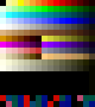

# shmupX — codemonkey.games

The final CMG launcher, rebuilt as **shmupX**: a Deno Fresh 2 + Vite app for
[Deno Deploy](https://deploy.deno.com) with a single built-in game — the shmupX
level editor, a standalone version of the cmg level editor.

The `.sav` / `game.json` pipeline (Dezaemon 2 Saturn save parsing, decoding,
mapping, atlas packing, schema validation) lives in the
[`packages/shmup-engine`](packages/shmup-engine) workspace member, published to
JSR as `@shmupx/shmup-engine`. The editor consumes it as a same-origin bundle
built by `deno task engine:bundle` into `static/engine/shmup-engine.js`.

## Layout

- `main.ts`, `routes/`, `vite.config.ts` — the Fresh shell (launcher marker
  injection + static files + fs routes).
- `desktop.ts`, `scripts/build-desktop.ts` — the packaged desktop launcher
  (`deno task build:windows` / `build:linux` / `build:mac`, see below).
- `lib/ps2/`, `scripts/build-ps2.ts` — the PlayStation 2 export
  (`deno task build:ps2`, see below). Pure Deno, no toolchain to install.
- `svelte-src/` — the launcher dashboard (Svelte 5), esbuild-bundled at build
  time into `static/dashboard.bundle.js` by `deno task dashboard:build`.
- `data/games.json` → `deno task games:manifest` → `static/games.manifest.json`
  — the OTA manifest the dashboard fetches (push to main = every client sees the
  new list, no rebuild).
- `static/editor/` — the shmupX level editor (single-file app). Its wave grid
  has a **VERT / HORIZ** switch on the stage rail: the same waves laid out top
  to bottom, or left to right the way a Dezaemon horizontal cart scrolls
  (auto-picked from a `.sav`'s game-mode bit). ADVANCED EDITORS → TILEMAP and
  PIXELS, and the map badge on the toolbar, open the two tools below on the open
  game.
- `static/palette.png` — the 288 Dezaemon 2 palette colours, one pixel each (see
  **The Dezaemon 2 palette** below); `palette-sheet.png` is the same as a
  picture. Both from `deno task deza:palette`.
- `static/pixel-editor/` — the **Pixel Editor**: 16×16-cell sprites drawn as
  palette indices over that palette and stored Saturn-native (see below).
- `static/tilemap-editor/` — the **SpriteX Tilemap Editor** mirrored here
  (spriteX's TILEMAP tab, plus level scenery in vertical/horizontal views, live
  pixel-sprite tiles and the **Tileset Extractor**). Both tools are in the CMG
  Desktop's Tools folder.
- `static/editor/dezaemon/` — the community Dezaemon 2 collection: 258
  `saves/Dez 2 - *.sav` games, `games-db.json` (title/developer/genre metadata,
  each game's page on satakore.com, and the YouTube id of the playthrough on
  that page) and `saves.manifest.json` — the served index the editor's .SAV LOAD
  GAME shelf reads, regenerated by `deno task deza:manifest` inside
  `deno task build`. Deploy can serve `static/` but can't list it at runtime, so
  the manifest is committed, exactly like `games.manifest.json`. A save the
  table knows gets a WEBSITE button on the import sheet and a VIEW WEBSITE row
  in the drawer; the 188 with a video get a ▶ on the shelf and on the launcher's
  coverflow, which previews it muted in place while hovered (or held, on a touch
  screen) and opens it in full on a press. Under the CMG Desktop (`/desktop/`)
  those links open in its Web Browser window rather than a browser tab — YouTube
  watch URLs are framed as the /embed/ player, since the watch page itself
  refuses embedding. 258 covers is more than left/right can walk, so the
  coverflow carries an A–Z rail down its right edge — swipe or drag it to scrub
  to a letter (`[` / `]` and the right stick step the same buckets) — and a
  filter over title, Japanese title, developer and genre, opened with `/`,
  ⌘/Ctrl+F or the ⌕ button. Buckets are derived from what is actually on the
  shelf, so a letter nobody used never appears, and pinned favorites keep their
  own ★ bucket at the top. Beside them, `mesh-library.json` is the ポリ吉 3D
  part library (224 meshes decoded from the disc's `MDLDT_01–56.CMP` by
  `deno task deza:meshlib`, committed — see **PlayStation 2** below) that the
  Model Viewer draws a save's sec7 compositions with.
- `static/editor/model-viewer.html` — the **Model Viewer**: a Dezaemon save's
  sec7 3D models (ポリ吉 part compositions, decoded by the engine but never used
  by play — the Saturn rendered them to CG cells) drawn on Phaser 4.2's
  `Mesh2D`. Phaser 4 has no 3D, so the engine package does the projection on the
  CPU (`packages/shmup-engine/src/model/`) and hands the game object flat
  screen-space triangles in painter order, coloured by pointing every UV at a
  cell of a swatch texture. Reached from the editor's toolbar badge, its
  drawer's MODEL VIEWER row and the .SAV import sheet's VIEW 3D link (the editor
  hands the decoded models over through `sessionStorage` and the viewer bridge
  database), from the CMG Desktop's Tools folder, with `?sav=<url>`, by dropping
  a `.sav` on it, or with `?demo=1`.
- `static/games/2028-ai/` — the editor's base game + play runtime (the Phaser 4
  engine that runs editor-authored levels). `game.bundle.js` here is a vendored
  prebuilt artifact — this repo has no build step for it (the sources live in
  the 2019-es7 checkout), so it carries a handful of edits by hand that a
  rebuild would silently drop:
  - `LEVEL_DATA_URL` fetches `foo.json` same-origin instead of from cmg's deploy
    origin. `tools/build-level/lib/stage.js` matches that exact string when it
    stages an offline export, so the two must change together.
  - `tryNavigatorVibrate` returns early when
    `navigator.userActivation.hasBeenActive` is false. Chrome blocks
    `navigator.vibrate()` before the frame has been tapped and logs an
    intervention for every call; the blocked call _returns false_ rather than
    throwing, so the function's own `try/catch` never suppressed it. Upstream
    fix belongs in `2019-es7/src/haptics.js`.
  - `window.__cmgSetPaused = cmgSetPaused` exposes the cmg pause closure to
    `static/phaser-plugins/extract-mode.js`. Embedded in the launcher the
    standalone PAUSE panel is never built, so extract mode has no button to ride
    and must pause the game itself; routing through this one closure keeps a
    single `cmgPaused` flag and the per-`Sound` bookkeeping. The plugin falls
    back to its own `loop.sleep()` if the line goes missing.
  - `cmgBroadcastCheats` posts the Guide's Cheats submenu to the launcher once
    the level has resolved, because the set depends on which level is running —
    see **A Dezaemon save is not 2028.Ai** below. `routes/games/2028-ai.tsx`
    used to send a fixed list from its `<head>` and no longer does.
  - A boss dies as the boss whatever finished it. `updateDezaColumns` (the
    Dezaemon sub-weapon 5 / charge 2 columns) used to bill the boss sprite and
    hand the kill to `enemyDie`, which destroyed the sprite without telling the
    boss machinery: no death drift, no STAGE CLEAR, and a skull balloon and TIME
    label left hanging over an empty sky. It now keeps `scene.bossHp` and the
    danger balloon in step, skips the boss while it is flying in, and routes the
    kill through `bossDie` — and `enemyDie` itself hands a boss over to
    `bossDie`, so no other weapon can repeat it. Upstream fix belongs in
    `2019-es7/src/phaser/game-objects/Enemy.js`.
  - The Dezaemon divergences below, all of them keyed off `isImportedLevel()`.
- `packages/shmup-engine/` — the JSR module: everything for editing/exporting
  `.sav` and `game.json` games.
- `spacetimedb/` — the online-2P module (see **Two players** below), published
  to SpacetimeDB. `static/netplay/` holds its generated client bindings and the
  bundled browser client.

## Tasks

```sh
deno task dev             # vite dev server (+ ngrok tunnel when available)
deno task build           # manifest + dashboard + engine bundle + vite build
deno task start           # serve the production build (_fresh/server.js)
deno task test            # shmup-engine tests
deno task check           # fmt + lint + type-check

deno task build:windows   # the launcher as a Windows .exe
deno task build:linux     # the launcher as a Linux .AppImage
deno task build:mac       # the launcher as a macOS .app
deno task build:desktop   # …whichever of those three matches this host
deno task build:ps2       # a level as a PlayStation 2 USB folder
deno task build:ps2:zip   # …as one .zip of that folder
deno task build:ps2:iso   # …plus a bootable disc image

deno task player2:art     # re-bake player 2's ship from shmup-party-phaser4
deno task deza:tonebank   # cut the Saturn tone bank out of a SNDPAC.BIN
deno task deza:meshlib    # decode the ポリ吉 3D part library off a disc image
deno task deza:palette    # write static/palette.png (+ palette-sheet.png) from DEZA2.PAL
deno task tonebank:table  # re-pack the instrument map into src/audio/
deno task netplay:bundle  # bundle the online-2P browser client
deno task netplay:generate  # regenerate its bindings from the module
deno task netplay:publish   # publish the module (needs `spacetime login`)
```

## The Dezaemon 2 palette

<https://codemonkey.games/palette.png> is the whole colour set the Saturn editor
paints with — `DEZA2.PAL` off the disc, 18 rows × 16 entries of u16be RGB555 —
as a **1 × 288 PNG, one pixel per entry in file order**. It is a data file that
happens to be an image: any tool can `fetch` it, draw it to a canvas and read
the colours back, and because 5→8-bit replication is lossless, `channel >> 3`
recovers the exact 5-bit values (the round trip is tested in
[`tests/palette_png_test.ts`](tests/palette_png_test.ts)). The same 288 words
ship in the engine as `DEZA2_PALETTE_WORDS`
([`packages/shmup-engine/src/palette/deza2-palette.js`](packages/shmup-engine/src/palette/deza2-palette.js),
also on the flat surface and the `./palette` subpath), which is what
`deno task deza:palette` writes the PNG from; with a disc image in
`dev-fixtures/` it reads `DEZA2.PAL` too and refuses to build if the two
disagree.



The rows line up with a save's palette bank (sec4, 16 × 16) and then run two
past it:

| rows  | entries | what                                                                                                                     |
| ----- | ------- | ------------------------------------------------------------------------------------------------------------------------ |
| 0–11  | 0–191   | the **192 system colours** — byte-identical to rows 0–11 of every save's sec4 (verified across the corpus; not editable) |
| 12–15 | 192–255 | the **4 user palettes** — empty on the disc (`0x0000`, an `0x0021` end marker); a save carries whatever its author mixed |
| 16–17 | 256–287 | 32 entries the **editor UI** itself draws with — not part of a save, and not addressable by a CG pixel                   |

RGB555 is Saturn order — R in bits 0–4, G in 5–9, B in 10–14, bit 15 is the CRAM
flag — and a CG pixel byte is `(palette << 4) | colour`, i.e.
`row * 16 +
column`: **for the first 256 entries the palette index is the pixel
byte**, and index 0 (system row 0, colour 0) is the transparent background. That
is the contract everything below is written to, so a future `.sav` writer gets
indexed cells whose bytes are already what sec0–3 store.

## Pixel Editor and Tilemap Editor

Two workbench tools alongside spriteX, both in the CMG Desktop's Tools folder
and the start menu, both reachable from the level editor, both on the same
Realtime Database as spriteX and the level editor.

**Pixel Editor** (`/pixel-editor/`). A pixel editor whose sprite is _data_, not
a picture: w × h palette indices over the 288 colours above (the default palette
source; the source registry has a Super Famicom entry declared for later),
rendered to RGBA on the way out. Sizes are 16×16 and the seven zako frame sizes
of the sprite bank (16×16, 32×16, 16×32, 32×32, 64×32, 32×64, 64×64), up to six
animation frames, pencil / eraser / fill / line / rect / picker, flips, shifts,
undo, PNG import (quantised to the nearest CG colour, padded to whole cells) and
a PNG strip download. The 64 user colours are mixable (quantised to 15 bits);
the UI rows are shown but locked, since a cell cannot carry them.

A save writes, in one update:

| path                      | what                                                                                                                                                                                                                                                                                                                                                                                            |
| ------------------------- | ----------------------------------------------------------------------------------------------------------------------------------------------------------------------------------------------------------------------------------------------------------------------------------------------------------------------------------------------------------------------------------------------- |
| `pixelSprites/{name}`     | the **Saturn-native record**: `format: "deza2-cg-v1"`, `w`, `h`, `cellsW`, `cellsH`, `frames[]` (each frame's w×h bytes in CG **cell order** — 256-byte 16×16 cells in reading order, byte = y·16+x, base64), `paletteBank` (256 u16be words in sec4 layout: system rows raw, user rows `0x8000\|colour`, base64), plus `png` (the frame strip as a data URL) for tools that only read pictures |
| `sprites/{name}` / `_{i}` | each frame as a data URL — what spriteX's PACKER lists under FIREBASE SPRITES                                                                                                                                                                                                                                                                                                                   |

So a sprite drawn here drops into a CG page unchanged, and the bank it needs
rides with it. The record is read back the same way (`?sprite=<name>`, or the
cloud list, which follows the database live).

**SpriteX Tilemap Editor** (`/tilemap-editor/`). spriteX's TILEMAP tab (Tiled
JSON + tileset PNG, tile and object layers, place / erase / pick, undo per
stroke, `tilemaps/*` in the cloud) ported here, with three additions:

- **Orientation.** NATIVE is the Tiled map as authored; VERTICAL and HORIZONTAL
  are the same cells laid out the way the game scrolls them. A Dezaemon stage's
  scenery is a 14-column × 768-row grid whose row 0 is where the stage _starts_
  — the runtime draws it at the bottom and scrolls up — and a horizontal cart is
  that grid a quarter turn over; VERTICAL puts the start at the bottom,
  HORIZONTAL at the left, PART jumps a 16-row screen at a time, and arrows move
  on the screen, not in the data.
- **Level scenery.** LEVEL SCENERY loads a cloud level (`levels/*`) and any of
  its stages; the level editor's TILEMAP badge hands over the open game instead
  (every stage, `backgroundCells`, the working atlas — through the same
  IndexedDB bridge the model viewer reads). The grid is `stage.background`
  (`{cols, rows, tiles}` — base64 u16be words: bits 0–9 index `backgroundCells`,
  bit 15 h-flip, bit 14 v-flip as the runtime reads them, `0xFFFF` empty) and
  edits go back two ways: **SAVE TO LEVEL** writes `stages/{stage}/background`
  (and the flat `background` when that is the record's open stage), and any new
  cells to `backgroundCells` and packed onto the level atlas; **APPLY TO
  EDITOR** posts the same over the editor's bridge channel (`tilemap-apply`),
  which the open level editor folds into its in-memory game — save there to keep
  it. Switching stages keeps each stage's unsaved edits, and a stage that had no
  scenery starts as an empty grid.
- **Pixel sprites as tiles.** TILE PALETTE → PIXEL SPRITES lists every non-empty
  16×16 cell of every `pixelSprites/*` record, live: a sprite saved in the Pixel
  Editor appears without a reload. **+ ADD TO MAP** appends the chosen cell to
  the map's tileset — for a level, to its `backgroundCells` as `{name}` (or
  `{name}_f{frame}_c{cell}` for a bigger sprite) — and selects it for placing.

**Tileset Extractor** (the second tab) is André Michelle's
[Online Tileset Extractor](https://easierbycode.com/tileset-extractor/) brought
in: load a level screenshot (or the two demos), set the tile size and a
**tolerance**, and every distinct tile is kept once, with the map of where each
went. Added here: **margin** and **spacing** (padding), a free grid **offset** —
drag the grid on the image, nudge it with the arrows, or type it — a **live
cut** of the tiles under the grid so alignment is checked by eye before running,
and cells the image edge cuts are skipped rather than refused. Downloads are
`tiles.png`, `map.json` (the original's `{map,
numCols, numRows}` plus a Tiled
map), `tiled.tmx` and the recreation; **→ OPEN AS MAP** puts the result straight
into the MAP EDITOR tab.

## Two players

Local 2P is join-in: a second pad pressing any face or shoulder button — or `O`
on a shared keyboard — puts a second ship in the air mid-run. It is gated on the
save's own game-mode bit1 (Dezaemon 2's "2P join-in"), with `?players=2` forcing
it on for levels that carry no decoded settings, the shipped 2028-ai game among
them.

Each ship carries its own HP, combo, powerups, barrier, charge, sub weapon and
bomb — including the engine's one-bomb-per-player rule. **Score is shared**,
which is a deliberate divergence from the hardware (see
`static/dezaemon-parity.html`). The HUD splits the HP and combo troughs
vertically, player 1 on top; the split animates in when player 2 joins and is a
one-way latch for the stage, so a ship going down leaves an empty slot rather
than resizing the bar player 1 has been reading all fight. One death does not
end the run — only losing every ship does, and a downed player can take the seat
back.

Player 2 flies the **trooper** from shmup-party-phaser4, baked into the
`game_asset` atlas beside Duke by `deno task player2:art` (idempotent, and it
also writes `packages/shmup-engine/src/player2-art.js` for imports). A save that
drew its own second ship — global sprite-bank refs 24-47, which the decoder now
extracts — flies that instead.

### Online

`?online=1` turns on cross-machine 2P over
[SpacetimeDB](https://spacetimedb.com). The browser running the game is the
**host** and stays authoritative: this simulation is not deterministic, so there
is nothing to lock-step. It announces its run, publishes a compact world
snapshot ~15Hz, and reads a guest's buttons back. A guest does not simulate — it
renders those snapshots and streams input, so joining is instant, needs no level
download, and cannot desync. The trade is that a guest sees their own ship at
the host's latency; their movement is predicted locally to hide most of it.

- `spacetimedb/module/src/index.ts` — three tables (`session`, `snapshot`,
  `input`), all keyed by the host's identity, plus a scheduled reaper for runs
  whose browser vanished.
- `static/netplay/src/` → `static/netplay/shmupx-netplay.js` — the browser
  client, bundled same-origin for the same reason the engine is.
- `static/phaser-plugins/netplay-lobby.js` — the live-runs panel on the title
  screen (with a real preview drawn from the host's snapshots) and the guest
  view.
- `game.bundle.js` `cmgNet*` — the host half.
- The launcher marks games with a live run (`svelte-src/Dashboard.svelte`).

Every part fails soft: no bundle (an offline export), no network or no database
leaves `?online=1` inert and the game plays exactly as it does offline.

Working on it locally:

```sh
spacetimedb-standalone start --data-dir /tmp/stdb --jwt-pub-key-path /tmp/stdb/id_ecdsa.pub --jwt-priv-key-path /tmp/stdb/id_ecdsa
cd spacetimedb && spacetime publish shmupx-netplay --server local --yes
deno test -A --no-check tests/netplay_smoke_test.ts   # skips when no server
```

Then open the game with
`?online=1&netplayUri=ws://127.0.0.1:3000&netplayDb=shmupx-netplay` in two tabs.
Shipping it means `spacetime login` and `deno task netplay:publish`.

Requires Deno canary (`deno upgrade canary`).

## A Dezaemon save is not 2028.Ai

The runtime plays two quite different things: 2028.Ai itself — a Capcom April
Fool's joke with its own staff, its own top-hatted G and its own tweet buttons —
and 258 carts other people wrote on a Saturn in 1997. `isImportedLevel()` in
`game.bundle.js` tells them apart (`meta.source === "dezaemon2"`, stamped by
`map-to-game.js`, with the `dezaemon*` records as a fallback), and everything
that is 2028.Ai's rather than the game's is keyed off it:

- **No tweet button, anywhere** — title, game over, ending. The staff roll is
  the cart's own credits: the three role labels and the 64×16 credit strips its
  author drew (settings `+0x5A..+0x5C`, global bank refs 208-231), plus the
  community table's row where there is one; where there is neither the card is
  empty rather than crediting the cart to 2028.Ai's staff and linking their
  Twitter accounts.
- **Its own title and ending.** The drawn TITLE 1/2 enter the way the author set
  them up on the editor's effect grids (settings `+0x29..+0x2C`: slide, spin and
  scale over 128 frames, then the white flash and the blinking PRESS 1P START
  BUTTON), and clearing the last stage plays the Saturn's staff roll — labels
  typed out over the stages' scenery, credit strips flying in from the corners,
  START for 4x — before the score card.
- **No CONTINUE?** A Dezaemon cart has no continue prompt — losing the last ship
  is GAME OVER and the cart returns to its title, so an imported save goes
  straight to the game-over half of `PhaserContinueScene` (score, high score, GO
  TO TITLE) and never sees the nine-second countdown. Cheats → **Allow
  Continues** (`?continues=1`) puts the prompt back, and a continue there
  resumes on the stage that killed you rather than restarting the run.
- **G is replaced by the ship.** When the prompt is on, the save's own player
  sprite idles in the portrait box G would have filled.
- **Its own cheats.** The Guide's Cheats submenu is broadcast per level: Boss
  Rush, a Start Stage slider bounded by the cart's real stage count, **Final
  Boss** (`?finalBoss=1` — the cart's last stage, opened at its boss) and Allow
  Continues. 2028.Ai keeps its own set, Akuma (`?boss=goki`) included.

## Desktop app

`deno task build:windows` / `build:linux` / `build:mac` package the launcher
itself into `build/desktop/` (git-ignored). `deno compile` embeds the Vite
build, so one file is the whole thing: it serves the app on `127.0.0.1:8787` (or
the next free port) and opens your browser at it. `--port N`, `--no-open` and
`SHMUPX_PORT` / `SHMUPX_HOST` / `SHMUPX_NO_OPEN` work on the artifact itself.

- `desktop.ts` — what gets compiled: the local server + browser launch.
- `scripts/build-desktop.ts` — the packaging (Vite build → `deno compile` →
  AppDir → `appimagetool`, or → `.app` bundle).

|                 | artifact                                                       | default arch                                                        |
| --------------- | -------------------------------------------------------------- | ------------------------------------------------------------------- |
| `build:windows` | `shmupX-windows-<arch>.exe` (icon: `static/app-icons/cmg.ico`) | `x86_64` — Windows on ARM emulates x64, not the reverse             |
| `build:linux`   | `shmupX-linux-<arch>.AppImage` (icon: `launcher-256.png`)      | this host's, so the AppImage runs where it was built                |
| `build:mac`     | `shmupX-mac-<arch>.app` (icon: built from `icon-*.png`)        | this host's on a Mac, else `aarch64` — Rosetta covers the other way |

All three artifacts carry the whole Dezaemon collection, so the save shelf works
offline in the packaged app — that is most of their size: ~426MB for the `.exe`
(deno compile does not compress the embedded VFS) against ~136MB for the
AppImage (whose squashfs does). Narrow `--include ./_fresh/client` to the
subtrees you need for a lean build.

Flags: `--arch x86_64|aarch64`, `--out <dir>`, `--skip-build` (reuse the
existing `_fresh/`), `--no-terminal` (Windows: no console window),
`--no-appimage` (stop at the raw Linux binary), `--no-bundle` (stop at the raw
macOS binary), `--no-export-tools`.

`--no-export-tools` is what the editor's export button rides on. It leaves out
`tools/build-level` and the base game (which the APK/desktop targets stage onto
real disk before spawning `node`), and also the **PS2 runtime**: the packaged
app has no sources to bundle and no Deno CLI to bundle with, so
`scripts/build-desktop.ts` compiles `main.js` once at packaging time
(`buildRuntimeBundle`) and embeds it beside a cached `athena.elf` — ~5MB, and
the difference between a PS2 export that works in the app and one that refuses.

The AppImage step needs a **Linux host**: `appimagetool` plus the type-2 runtime
for the target arch are downloaded into `build/desktop/.cache/` on first use
(`$APPIMAGETOOL` or one on `PATH` wins). Cross-compiling the binary itself works
from anywhere Deno runs.

The `.app` is assembled by the script itself — `Info.plist`, `PkgInfo` and an
`.icns` built out of `static/app-icons/icon-{32,128,256,512}.png` (an icns is
just a container of PNGs, so no `iconutil` and no Mac needed). On a Mac it is
then sealed with `codesign --force --sign -`; a bundle cross-built elsewhere
arrives unsigned and the build prints the one command to run on the Mac it lands
on.

The packaged app embeds `tools/build-level` + `static/games/2028-ai`, so the
editor's **Export to APK** button works inside it — `routes/api/build-apk.ts`
stages them out of the read-only `deno compile` VFS onto disk before spawning
`node`. It costs ~0.3MB, since Deno dedupes the game against the identical copy
Vite already put in `_fresh/client`.

### One level as a desktop app

Passing a level name builds _that game_ instead of the launcher, through the
same per-level Electron export the editor drives:

```sh
deno task build:windows "My Level"   # → build/<slug>/dist/<slug>.exe
deno task build:linux "My Level"     # → build/<slug>/dist/<slug>.AppImage
deno task build:mac "My Level"       # → build/<slug>/dist/<slug>.dmg
deno task build:desktop "My Level"   # → whichever this host builds natively
```

Extra flags go straight to `tools/build-level` (`--skip-bgm`, `--level-file`,
`--package-id`, `--win-target`, `--mac-target`, `--stage-only`); `--arch`
becomes its `--win-arch` / `--mac-arch`. This path needs Node and
electron-builder, a **Windows build from Linux needs `wine` on `PATH`** —
electron-builder rcedits the packaged `.exe` through it whatever the target is —
and a **Mac build needs a Mac**, for `hdiutil` and `codesign`.

## PlayStation 2

```sh
deno task build:ps2                     # the game this repo ships
deno task build:ps2 "Master Arena Mod"  # that Firebase level
deno task build:ps2 --sav "Dez 2 - Chohsoku Stringer.sav"   # that Saturn cart
```

Any of them gives you **build/ps2/&lt;level name&gt;/** holding the ways PS2
homebrew is actually run:

|                   |                                                                                                                                                         |
| ----------------- | ------------------------------------------------------------------------------------------------------------------------------------------------------- |
| `<LevelName>/`    | the **athena.elf build** — copy the folder to a USB stick (or a memory card, or an HDD partition) and launch `athena.elf` from wLaunchELF, OPL or FMCB  |
| `<LevelName>.zip` | the same folder as **one file** (`--zip`), for a browser download or a chat window — unpack it and you have the folder back                             |
| `<LevelName>.iso` | the same tree as a **bootable disc** (`--iso`) — PCSX2, the launcher's own in-browser PS2 player, or a burned disc on a console that will boot homebrew |

The folder is the default; `--zip` swaps it for the archive and `--iso` adds the
disc beside whichever of the two was written. The two sibling tasks are this one
with the flag pre-set, so the everyday spellings are short:

```sh
deno task build:ps2:zip "Chohsoku Stringer" --sav="./Dez 2 - Chohsoku Stringer.sav"
deno task build:ps2:iso --sav="./Dez 2 - Chohsoku Stringer.sav"
```

**Straight from a `.sav`.** `--sav <path>` skips the editor and Firebase
entirely: [`lib/ps2/sav.ts`](lib/ps2/sav.ts) runs the same pipeline the editor's
importer does — `normalize` → `parse` → `decodeSave` → `mapSaveToGame` out of
[`packages/shmup-engine`](packages/shmup-engine) — and lands on the same level
record the Firebase reader produces, so nothing downstream can tell the two
apart. The name is then optional, as the second command above shows: leave it
off and the filename supplies it, with the shelf's own `Dez 2 -` prefix stripped
("Dez 2 - Chohsoku Stringer.sav" → "Chohsoku Stringer"). A save holds up to ten
stages and the console runs one, so the export takes the first stage with
anything placed on it; `--stage <n>` picks another, and `--slot <n>` picks
between games in a cart image that holds more than one. Pair it with
`--cover <slug>` (below) to put that save's shelf shot on the title screen.

There is nothing to install: no ps2dev, no C compiler, not even Node. The
console runs the game as **JavaScript**, because `athena.elf` is
[AthenaEnv](https://github.com/DanielSant0s/AthenaEnv) — a QuickJS interpreter
for the PS2 with a 2D drawing, pad and file API. The game itself is
[5velte-ps2](https://github.com/easierbycode/svelte-ps2)'s AthenaEnv port of
this very shooter, pulled from JSR and compiled to one `main.js` by
`deno bundle` (cached in `build/ps2/.cache/`, so only the first build is slow).
The AthenaEnv release is downloaded once and cached beside it;
`--athena-elf
<path>` or `$ATHENA_ELF` points at a local build instead and skips
the network entirely.

Everything else in the export is data, produced by `lib/ps2/`:

- The editor's atlases are 2048px sheets and the Graphics Synthesizer tops out
  at 1024×1024 with 4MB of VRAM to also hold the frame buffers, so every atlas
  is **cut apart and repacked** into the smallest power-of-two sheet that fits
  (512px by default), with a `meta.ps2DisplayScale` telling the runtime how far
  to scale each frame back up. Sprites keep their original on-screen size and
  lose texture resolution — `--atlas-max 1024` trades VRAM for sharpness.
- The level's custom atlas is merged over the base one exactly as the browser
  player composites it, and the result is made **self-sufficient**: a frame the
  level names but never customised is pulled from the base sheet, because the
  PS2 port looks for every one of a level's own sprites in the level atlas.
- The ISO is written here too ([`lib/ps2/iso9660.ts`](lib/ps2/iso9660.ts)) — no
  mkisofs, no xorriso. Names are uppercase ISO 9660 level 2 with a `;1` suffix,
  which ps2sdk's `cdfs` driver matches case-insensitively against the lowercase
  paths the game opens.

Flags: `--out <dir>`, `--level-file <path>` (a local JSON export instead of
Firebase), `--sav <path>` (a Dezaemon 2 cart image), `--stage <n>`,
`--slot <n>`, `--athena-elf <path>`, `--refresh-athena`, `--atlas-max <px>`,
`--sndpac <path>`, `--no-audio`, `--no-music`, `--uncapped`, `--game-fps <n>`,
`--cover <slug|png>`, `--iso`, `--zip`. Each takes `--flag value` or
`--flag=value`, which is the readable spelling for a path with spaces in it.

**Game speed.** The port runs its logic on a fixed 30 Hz step and that step is
what moves everything; the frame rate is separate and changes none of it. 30 is
the pace the browser plays at and on a TV it reads as slow motion, so the export
runs the logic at **120 steps a second** — it hands `FixedStep` a clock four
times fast, which is the only thing in the bundle that reads `rt.Timer`.
`FRAME_MS` is untouched, so each step advances tweens and the scheduler by
exactly what it always did. `--game-fps 30` restores the browser's pace.

**Title screen.** `--cover <slug>` takes the shelf's title-screen shot for a
Dezaemon save — 256x480, which is exactly the logical screen the port lays its
title scene out in — and makes it the whole title screen, dropping the stock
logo, subtitle and sliding "titleG" so nothing covers it. A level saved under a
name other than its save's has no link back to the shelf, which is why the slug
is given rather than guessed: `--cover mucha-kucha-fighter` for a level saved as
`fighter`. A `.png` path works too. Failing that, a level whose record carries
`dezaemonTitle` (the save's own drawn TITLE 1/2 strips) uses those instead.
`title_bg` is the one frame the title scene draws in raw screen coordinates —
`drawFrameTL(..., 0, 0, SCREEN_W / 256, SCREEN_H / 480)` — rather than through
the viewport the way `drawStageBg` does, and the letterbox is painted over it
every frame. So only the middle 96 of its 256 columns are ever seen, stretched
2.5x, and a cover dropped in untreated shows as the middle third of itself. The
exporter squeezes it into exactly those columns and pads either side; the port's
own stretch undoes the squeeze and the whole title comes out at its own
proportions. When a cover is present game_ui gets a 1024 sheet rather than 512,
which packs it at 1/2 instead of 1/4 — 48 texels across the 239 pixels it is
shown in rather than 24 — and keeps the working set at 3.57 MB of the GS's 4.

**The output is a folder** — `athena.elf`, `main.js`, `athena.ini` and
`assets/`. Copy it to a USB stick, or point an emulator straight at
`athena.elf`. `--iso` also writes a disc image; it is opt-in because the folder
is what actually gets run, and a burned homebrew disc needs FMCB or a modchip
regardless.

**Sheets ship paletted.** Every atlas goes out as an 8-bit indexed PNG, which
AthenaEnv uploads as `GS_PSM_T8` — a quarter of the VRAM of the RGBA form. That
is the difference between fitting in the GS's 4 MB and not: the three sheets are
2.51 MB at 32bpp and the framebuffer alone (640x448, double-buffered, 32-bit) is
2.19 MB of the 4, so the RGBA build over-committed and AthenaEnv's texture
manager had to evict and re-upload sheets over DMA every frame. Paletted they
come to 0.63 MB and everything stays resident.
[`lib/ps2/palette.ts`](lib/ps2/palette.ts) does the median cut — the sheets hold
17k-32k distinct colours, so it is lossy, at a measured mean error under 3.2 of
255 — and the build log reports the count and error per sheet. The palette is
ordered with every non-opaque entry first, because AthenaEnv defaults palette
alpha to PS2-opaque `0x80` and halves whatever `tRNS` covers: an opaque 255
inside that run would come back as 127 and make solid pixels faintly
see-through.

**Booting the disc.** If you do build one, boot it **with fast boot enabled** —
this is a homebrew disc, and a full BIOS boot will not run one. The retail BIOS
authenticates the disc and drops to _"Please insert a PlayStation or PlayStation
2 format disc"_; fast boot skips that and `LoadExec`s the ELF named in
`SYSTEM.CNF` directly. In PCSX2 that is the default — just make sure you are not
using _Boot Full (with BIOS)_. The log tells you which you got:

```
ELF Loading: cdrom0:\ATHENA.ELF;1     <- fast boot, correct
ELF Loading: , EntryPoint = 0xFFFFFFFF <- full BIOS boot, disc refused
```

AthenaEnv finds its own boot path by special-casing `cdrom0:`, `mass:` and
`hdd0:` (`src/main.c`), so a disc is the path it definitely handles; _Run ELF_
on `athena.elf` goes through `host:`, which is not one of those and is not
something this export is tested against. The folder build is for a USB stick, a
memory card or an HDD partition, launched from wLaunchELF, OPL or FMCB.

**Two screen calls the port cannot make.** AthenaEnv v4 turns on a depth test
with no Z-buffer behind it, which blanks every other flip, and leaves VSync off,
which puts the flip mid-scanout. Either one alone is a console that draws
nothing at all while every other check still passes. So
[`runtime-entry.ts`](lib/ps2/runtime-entry.ts) does
`Screen.setParam(Screen.DEPTH_TEST_ENABLE, 0)` and `Screen.setVSync(true)`
before anything else, and the smoke test asserts both — this is a 2D game drawn
in painter's order and it wants neither. (Credit to
[ps2-mario](https://github.com/easierbycode/ps2-mario), which had already found
this.)

The editor drives the same code: its **TARGET → PS2** option posts to
`routes/api/build-apk.ts`, which — unlike every other target — runs the build
in-process rather than spawning `node tools/build-level`.

It works in the **packaged desktop app** as well as in a checkout, which takes
three adjustments, because a `deno compile` binary is a read-only VFS with no
Deno CLI beside it:

- the runtime is **pre-compiled**. `buildRuntimeBundle` produces one
  level-independent `main.js`, so `scripts/build-desktop.ts` runs it once at
  packaging time and embeds the result (plus `athena.elf`); the route hands it
  back as `runtimeJs` and no `deno bundle` is needed. A checkout still bundles
  on every build, so an edit to `lib/ps2` lands in the very next disc.
- everything written goes to
  [`lib/build-workspace.ts`](lib/build-workspace.ts)'s directory on real disk,
  and [`routes/api/build-artifact.ts`](routes/api/build-artifact.ts) serves from
  there as well as from a checkout's `build/`.
- the base game is **staged out of the VFS first**. Deno reads the VFS happily,
  but the sound packs shell out to `ffmpeg`, and a separate process cannot see
  it at all — the same reason `node tools/build-level` gets staged out. Without
  that the app built a perfectly good disc with every sound missing.

What a packaged export still lacks is the Dezaemon tone bank, which comes from a
`SNDPAC.BIN` in `dev-fixtures/` — community disc content that is not shipped.

**What the editor offers when the build lands.** A finished PS2 export is three
things at once, so the panel under the EXPORT button offers all three rather
than printing a path and stopping:

|                            |                                                                                                                                |
| -------------------------- | ------------------------------------------------------------------------------------------------------------------------------ |
| DOWNLOAD DISC (.ISO)       | the disc image, streamed by [`routes/api/build-artifact.ts`](routes/api/build-artifact.ts)                                     |
| DOWNLOAD USB FOLDER (.ZIP) | the athena.elf folder, zipped on the way out by the same route                                                                 |
| → PS2 LIBRARY              | install the Play! core if it is not already here, file the disc in the launcher's own PS2 shelf, and play it — in this browser |

[`static/ps2-library.js`](static/ps2-library.js) is the shared half: the editor
imports it at runtime, the dashboard at bundle time, so both surfaces use one
shelf (an IndexedDB store), one core-install path and one rule for what
`emu-sw.js` may mirror. A disc filed from the editor therefore also appears in
the launcher's **PLAYSTATION 2** section, ahead of the mirror's hosted rows and
marked `built in this editor`; re-exporting the same level replaces its row
rather than adding another.

Two things follow from how Play! works. The **disc** is what gets filed, not the
`athena.elf`: Play! will boot a bare ELF, but AthenaEnv would then have no
device to read `main.js` and `assets/` from, and only the `.iso` carries the
whole tree behind a `SYSTEM.CNF`. And the player opens as a **top-level
navigation** rather than in the launcher's frame, because Play! keeps guest RAM
in a `SharedArrayBuffer` and only a cross-origin-isolated document gets one —
which an iframe cannot be unless its embedder is too. That is the mode
`play.html`'s own BYOD path is written for, exit gestures (Escape, SELECT+START,
two held corners) included.

**Audio.** audsrv splits sound in two, and so does the export.
[`lib/ps2/sound-pack.ts`](lib/ps2/sound-pack.ts) builds both packs and
[`lib/ps2/runtime-sound.ts`](lib/ps2/runtime-sound.ts) is the console-side
`SoundPlayer` that plays them; both need **ffmpeg on the build host**, and
without it the export is silent as it always was.

- **Effects and voices** are one-shots, which the SPU2 takes only as PS2 ADPCM
  (`Sound.Sfx`). All 60 keys the port loads are re-encoded through
  [`lib/ps2/adpcm.ts`](lib/ps2/adpcm.ts) — a transliteration of ps2sdk's
  `adpenc`, checked byte-for-byte against a golden vector in
  [`tests/adpcm_test.ts`](tests/adpcm_test.ts). The port's baked-in paths do not
  match the base game's layout, so each key is resolved against the game's tree
  and staged where the port will look; the runtime swaps `.wav` for `.adp`.

  Not all 60 make it onto the disc. audsrv keeps samples in **IOP RAM**, of
  which there are 2 MB in total, so the pack has a **1 MB budget**
  (`--sfx-budget <KB>`) and fills it gameplay-first: every `se_*` together is a
  quarter of it, and what is left buys voice lines shortest-first, so a
  four-second boss taunt is what goes. The build names every key it dropped.

  The port then asks audsrv for all 60 regardless, and on a console an absent
  one is not free: cdfs answers a miss by scanning the whole directory and
  printing `***** FILE ... CAN NOT FOUND ******`, which costs real boot time and
  reads like a broken disc. So the build bakes the staged list into `main.js` as
  `__PS2_SFX__` and [`runtime-sound.ts`](lib/ps2/runtime-sound.ts) skips
  anything absent from it rather than going looking.
  [`tests/ps2_runtime_smoke_test.ts`](tests/ps2_runtime_smoke_test.ts) boots the
  newest export and asserts the runtime probes for nothing the disc lacks.
- **Music** is streamed, as 22.05 kHz mono **WAV** — 31.9 MB of the export, so
  `--no-music` drops it and keeps the effects. Not Ogg, even though the port
  asks for `.ogg` and AthenaEnv does link libVorbis: Vorbis gets decoded inside
  audsrv's fill-buffer callback (`ov_read` in `sound_ogg_fillbuf_handler`), and
  a stream that `oggdec` reads perfectly on a desktop still killed the console
  the moment the adventure scene started the music. The WAV handler is a bare
  `fread` into audsrv's buffer with no decoder near it. `runtime-sound.ts`
  rewrites the extension. Two details worth knowing: `load_wav` reads the
  canonical 44-byte header into a struct of exactly that shape and then seeks to
  `0x30` for the samples — four bytes past it — so each track is written with
  four bytes of lead-in silence; and `Sound.Stream` does not loop, so the
  runtime rewinds a finished track itself, which is why `runtime-entry.ts` runs
  its own frame loop rather than the package's `runNativeLoop`.

Then there is the Dezaemon 2 tone bank:
[`lib/ps2/tone-bank-pack.ts`](lib/ps2/tone-bank-pack.ts) runs the 116-instrument
map through the same encoder to produce `assets/sounds/tonebank/` — one `.adp`
per distinct sample, with the loop points carried in the SPU2 block flags, plus
a `tonebank.json` saying which instrument layer plays which at what root pitch,
level and pan. Nothing plays it on the console yet: `Sound.Sfx` has no
playback-rate control, so sounding a note off the bank means rendering it ahead
of time rather than pitching a sample live the way the browser does.
`athena.ini` gets `audsrv = true` when any pack is staged.

The samples come from `SNDPAC.BIN`, which is disc content: it is not in this
repo and is never published. Drop a Dezaemon 2 disc image into the gitignored
`dev-fixtures/` and [`lib/sndpac.ts`](lib/sndpac.ts) pulls the file out of it
with the engine's ISO 9660 reader ([`lib/disc-file.ts`](lib/disc-file.ts) is the
shared scan); `--sndpac <path>` points at a bank directly and `--no-audio`
forces a silent build. **A fresh checkout has no disc, so it gets no tone bank**
— the effects and the music still come through, since they are the game's own
files.

**Derived tables are a different matter**, and one of them is new (decided
2026-09-02): the ポリ吉 3D part library. Reverse-engineered tables extracted
from the disc's binaries have always been committed — the boss movement scripts,
the accompaniment patterns and the instrument map all live in
[`packages/shmup-engine/data/`](packages/shmup-engine/data/). `MDLDT_01–56.CMP`
hold the 224 meshes a save's sec7 models are compositions of, and the level
editor's Model Viewer needs them in production, so `deno task deza:meshlib`
decodes them out of a local disc image into the committed, served
[`static/editor/dezaemon/mesh-library.json`](static/editor/dezaemon/mesh-library.json)
(geometry, polygon and colour tables — derived data, ~630 KB, no bytes of the
disc). It is the first of those tables large enough to be served to the browser
rather than bundled into the engine. Like `saves.manifest.json` it is
regenerated by hand and committed; Deploy has no disc to rebuild it from, and
the task exits 0 with a note when it finds none.

[`tests/ps2_runtime_smoke_test.ts`](tests/ps2_runtime_smoke_test.ts) boots the
built `main.js` against a stand-in for AthenaEnv's globals (including the
`Sound` binding audsrv publishes) and plays several hundred frames, which is
what catches an asset the game opens but the exporter never wrote — sheets and
sounds alike. It tests the newest export in `build/ps2/`, not the largest.

## Emulators (opt-in)

shmupX ships no emulators. Settings → EMULATORS lists the eight cores in
[`static/emulators.json`](static/emulators.json); enabling one downloads it, and
the console then appears as a tile in the top strip. With nothing installed
there is only one section, so the strip hides itself entirely.

Nothing is vendored here. [`static/emu-sw.js`](static/emu-sw.js) is a service
worker that mirrors an installed core's path prefixes from the cmg origin into
Cache Storage, fetching each file the first time it is asked for. That is why
installing needs no file list — the players pull their own cores, BIOS and ROMs,
and each request materialises on use. Installing only pre-warms the player page,
the console's manifest and the shared assets so the shelf is usable at once.

It has to be a worker rather than plain fetches:

- The gamepad→keyboard input the launcher synthesises only reaches a
  **same-origin** frame (`gamepad-support.js` bails silently otherwise), so a
  player loaded straight from cmg would be cross-origin and quietly unplayable.
  Every byte has to arrive under our own origin.
- PS2 and Switch need SharedArrayBuffer, so their responses are stamped
  COOP/COEP, and every mirrored subresource gets CORP or `require-corp` rejects
  it. `ISOLATED_PLAYERS` in `main.ts` and `vite.config.ts` covers the case where
  those files are served from disk instead — keep the three lists in sync.
- HEAD is mirrored as well as GET: EmulatorJS HEADs a ROM for its
  `content-length` before streaming it and aborts the load if that 404s.

Two path notes. The catalogue's `shared` entries and each core's `icon` sit
outside every core prefix, so the dashboard adds them to the prefix set it hands
the worker. And PS2's web builds live under `/games/<slug>/`, which is listed
per slug rather than as a bare `/games/` — that prefix would shadow shmupX's own
`/games/2028-ai` with cmg's copy.

## Deploy

Deno Deploy git integration: the app is linked to this repo in the Deploy
dashboard (the app slug decides the default `<app>.<org>.deno.net` URL — it is
not set from this file), and every push to main triggers a build.

**App Directory must be the repository root.** Deploy's framework detection
scans the tree and will happily pick `./packages/shmup-engine` (the JSR
workspace member) as the app directory. Everything still builds — install,
manifest, bundles and `vite build` all succeed at the root — and then the Fresh
finalize step fails with `Could not find _fresh folder after building project`,
because it looks for `_fresh` inside that app directory. Leaving App Directory
blank in the app config (it defaults to the repo root) fixes it, and is also
what makes Deploy read the `deploy` block below instead of dashboard settings.

The `deploy` block in `deno.json` is what that build follows:

- `install` — `deno install` (npm deps for vite/esbuild/svelte).
- `build` — `deno task build` (manifest → BGM → dashboard bundle → engine bundle
  → `vite build`).
- `runtime.entrypoint` — `./_fresh/server.js`, the built server that wraps the
  Fresh handler in `{ fetch }`. This must be set explicitly: `main.ts` exports a
  Fresh `App`, which has no `fetch` and cannot serve traffic, so leaving Deploy
  to auto-detect an entrypoint yields a build that never produces a working
  deployment.

Point the `codemonkey.games` domain at the app in the Deploy dashboard.
